# خواننده تلگرام

<!-- TOP_NAV START -->

<a href="https://github.com/SIL3NC398/aio-downloader/blob/main/telegram/content/archive_1.md" style="display:inline-block; padding:6px 12px; margin:0 4px; background-color:#2ea44f; color:white; text-decoration:none; border-radius:4px; font-weight:bold;">صفحه بعد</a>

<!-- TOP_NAV END -->

<!-- MSG START -->

---
📅 بروزرسانی: 1405/02/29 18:19
---

## VahidOOnLine — post 240977

  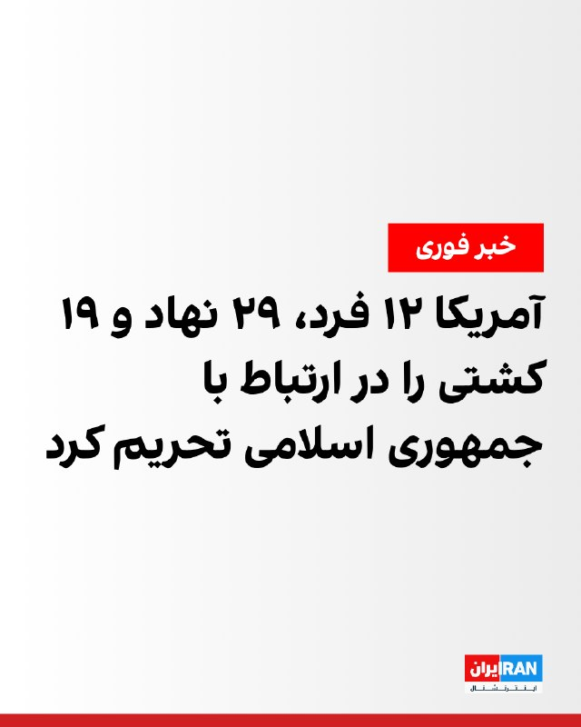

وزارت خزانه‌داری آمریکا اعلام کرد واشینگتن تحریم‌های تازه‌ای علیه جمهوری اسلامی اعمال کرده است

وزارت خزانه‌داری آمریکا ۱۲ نفر، از جمله چهار ایرانی، یک مصری، پنج فلسطینی، یک اسپانیایی و یک شهروند ترکیه را در فهرست تحریم‌ها قرار داد.

همچنین ۲۹ شرکت و نهاد و ۱۹ کشتی نیز به فهرست تحریم‌های آمریکا اضافه شدند.
‌🏁 🇬🇧 IranintlTV

🤖 @VahidOOnLine

## VahidOOnLine — post 240976

  <a href="telegram/content/VahidOOnLine_240976_1779202141.mp4" target="_blank">🎬 Download video</a>

سازمان جهانی بهداشت شیوع ابولا در جمهوری دموکراتیک کنگو و اوگاندا را وضعیت اضطراری بهداشت عمومی با اهمیت بین‌المللی اعلام کرده است. تاکنون ده‌ها مورد مشکوک و چندین مورد مرگ ثبت شده و برخی مبتلایان از کنگو به اوگاندا سفر کرده‌اند.
سازمان جهانی بهداشت این وضعیت را به دلیل گسترش فرامرزی، افزایش سریع موارد، مرگ کادر درمان و ضعف زیرساخت‌های بهداشتی اضطراری اعلام کرده است.
در واکنش به شیوع، برخی کشورها از جمله آمریکا محدودیت‌های سفر اعمال کرده و تیم‌های بین‌المللی برای کنترل بیماری به منطقه اعزام شده‌اند.
مقامات تاکید کرده‌اند خطر برای عموم مردم خارج از مناطق درگیر پایین است، اما بیماری از طریق تماس مستقیم با مایعات بدن افراد مبتلا منتقل می‌شود و می‌تواند کشنده باشد. علائم بیماری شامل تب ناگهانی، خستگی شدید، درد عضلانی، اسهال، استفراغ و در موارد شدید خونریزی است.
‌🏁 🇬🇧 ManotoTV

🤖 @VahidOOnLine

## VahidOOnLine — post 240975

  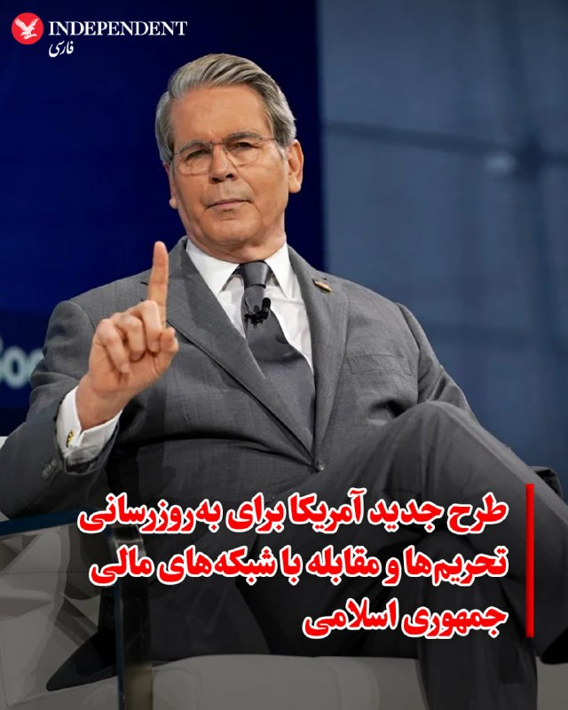

♦️ اسکات بسنت، وزیر خزانه‌داری آمریکا، روز سه‌شنبه ۲۹ اردیبهشت در نشست مبارزه با تامین مالی تروریسم در پاریس، از متحدان غربی و آسیایی خواست تا با جدیتی بیشتر، شبکه‌های مالی و بانکداری سایه‌ای جمهوری اسلامی را متلاشی کنند. او تاکید کرد که شرکای اروپایی باید با بستن شعب بانکی، افشای شرکت‌های صوری و تحریم حامیان مالی ایران، در کنار واشنگتن بایستند.
 
این درخواست در راستای برنامه تحریمی جدید دولت ترامپ موسوم به «خشم اقتصادی» (Economic Fury) مطرح شده است؛ طرحی که هدف آن اعمال فشار بر تهران جهت بازگشایی تنگه هرمز و آزادسازی جریان نفت است. وزارت خزانه‌داری آمریکا در چارچوب این برنامه، تاکنون نزدیک به نیم میلیارد دلار ارز دیجیتال مرتبط با حکومت ایران را مسدود کرده است.
 
وزیر خزانه‌داری آمریکا همچنین از بازنگری و حذف نام‌های قدیمی و منقضی‌شده از لیست تحریم‌ها (SDN) خبر داد تا بانک‌ها بتوانند روی پیچیده‌ترین شگردهای دور زدن تحریم‌ها تمرکز کنند. بسنت گفت این وزارتخانه رویکردی پویا را دنبال خواهد کرد و در صورت تغییر رفتار جبهه مقابل، آماده تعدیل تحریم‌ها خواهد بود.
‌🇸🇦 Indypersian

🤖 @VahidOOnLine

## VahidOOnLine — post 240974

  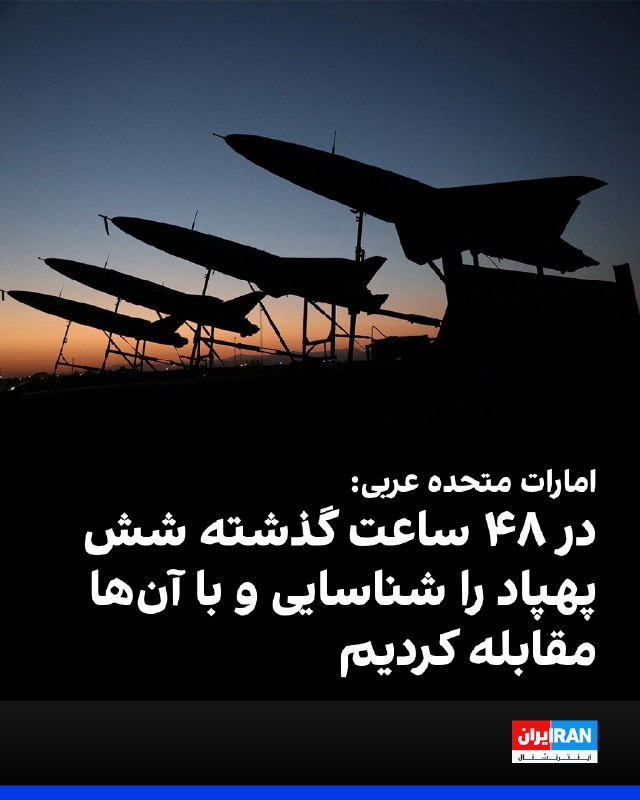

وزارت دفاع امارات متحده عربی اعلام کرد در ۴۸ ساعت گذشته شش پهپاد را شناسایی و با آن‌ها مقابله کرده است.
این وزارتخانه افزود این پهپادها از خاک عراق پرتاب شده بودند.

روز یک‌شنبه نیز وزارت دفاع امارات متحده عربی از مقابله با سه پهپاد شلیک‌شده از مرزهای غربی خبر داد. بر اساس این گزارش، پدافند هوایی این کشور دو فروند از پهپادها را منهدم کرد، اما پهپاد سوم به یک ژنراتور برق در خارج از محدوده داخلی نیروگاه هسته‌ای براکه در منطقه الظفره اصابت کرد.
‌🏁 🇬🇧 IranintlTV

🤖 @VahidOOnLine

## VahidOOnLine — post 240973

♦️ماجد الانصاری، سخنگوی وزارت خارجه قطر، سه‌شنبه ۲۹ اردیبهشت‌ماه در نشست هفتگی رسانه‌ای گفت کشورهای منطقه از آتش‌بس میان جمهوری اسلامی و آمریکا حمایت می‌کنند و خواهان جلوگیری از هرگونه تنش‌افزایی و جنگ تازه‌اند.

او تاکید کرد موضع دوحه به‌روشنی به آمریکا اعلام شده و هرگونه تشدید تنش، تاثیر فوری بر مردم منطقه خواهد داشت. الانصاری افزود در میان کشورهای منطقه «همبستگی روشنی» برای حمایت از میانجیگری و حفظ آتش‌بس وجود دارد.

سخنگوی وزارت خارجه قطر همچنین گفت دوحه از ادامه مسیرهای دیپلماتیک و گفتگوهای بیشتر برای دستیابی به توافق حمایت می‌کند و به میانجیگری پاکستان در این روند اشاره کرد.
‌🇸🇦 Indypersian

🤖 @VahidOOnLine

## VahidOOnLine — post 240972

  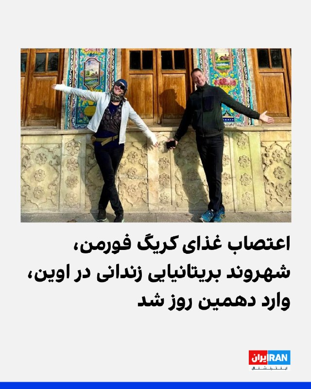

طبق اطلاعات رسیده به ایران‌اینترنشنال، کریگ فورمن، شهروند بریتانیایی که همراه همسرش، لیندزی فورمن، ۱۷ ماه است در ایران زندانی‌اند، از ۱۰ روز پیش در زندان اوین، در اعتراض به محرومیت از تماس تلفنی، ملاقات با همسرش و دیدار با وکیل، اعتصاب غذا کرده و تنها آب، قند و نمک مصرف می‌کند.

یک منبع آگاه از وضعیت این زندانیان به ایران‌اینترنشنال گفت آن‌ها پس از مصاحبه با بخش جهانی بی‌بی‌سی که در آن درباره دشواری شرایط بسیاری از ایرانیان سخن گفته بودند، از تماس تلفنی و ملاقات با یکدیگر محروم شدند و مقام‌های زندان حتی ملاقات با وکیل را نیز قطع کردند؛ موضوعی که باعث اعتصاب غذای کریگ فورمن شد.

این منبع با اشاره به وضعیت جسمانی او گفت فورمن پس از ۱۰ روز اعتصاب غذا وضعیت مناسبی ندارد و افزود اعتراض او جدا از محرومیت از ملاقات و تماس به این است که با وجود مشاهده انتقال هم‌بندی‌هایش برای اجرای حکم اعدام، اجازه ندارد درباره آنچه در زندان دیده و شرایط خود سخن بگوید.

به گفته این منبع، فورمن بارها گفته مقام‌های زندان و دستگاه قضایی به او «وعده‌های دروغ» می‌دهند و او نمی‌فهمد چرا باید «این همه دروغ» از مسئولان جمهوری اسلامی بشنود.
‌🏁 🇬🇧 IranintlTV

🤖 @VahidOOnLine

## VahidOOnLine — post 240971

  <a href="telegram/content/VahidOOnLine_240971_1779202144.mp4" target="_blank">🎬 Download video</a>

یک شهروند با ارسال پیامی به ایران‌‌اینترنشنال می‌گوید: «مجبورم روزی سه بار بروم در صف پمپ بنزین تا بتوانم ۱۰ لیتر سوخت بگیرم. آن‌وقت در صداوسیما از گرانی بنزین و تورم در آمریکا و اروپا می‌گویند.»
‌🏁 🇬🇧 IranintlTV

🤖 @VahidOOnLine

## VahidOOnLine — post 240970

  

اسکات بسنت، وزیر خزانه‌داری آمریکا، اعلام کرد از متحدان واشینگتن خواسته شده با شدت بیشتری شبکه‌های مالی تهران را هدف قرار دهند.
او گفت کشورهای اروپایی باید برای تحریم تامین‌کنندگان مالی جمهوری اسلامی، شناسایی شرکت‌های پوششی و صوری، بستن شعب بانکی و مقابله با نیروهای نیابتی تهران همکاری کنند.
‌🏁 🇬🇧 IranintlTV

🤖 @VahidOOnLine

## VahidOOnLine — post 240969

  <a href="telegram/content/VahidOOnLine_240969_1779202146.mp4" target="_blank">🎬 Download video</a>

به‌دنبال وزش باد شدید و خیزش گرد و خاک، کیفیت هوای تهران در شرایط ناسالم و قرمز قرار گرفت و به همه شهروندان توصیه شده از تردد غیرضروری در فضای باز خودداری کنند. اداره کل هواشناسی استان تهران نیز اعلام کرده است که طی ۲۴ ساعت آینده وزش باد و گرد و خاک در سطح استان ادامه خواهد داشت.
‌🏁 🇬🇧 ManotoTV

🤖 @VahidOOnLine

## VahidOOnLine — post 240968

  <a href="telegram/content/VahidOOnLine_240968_1779202147.mp4" target="_blank">🎬 Download video</a>

انفجاری در حاشیه شرقی دمشق و در نزدیکی مرکز مدیریت تسلیحات وابسته به وزارت دفاع سوریه در منطقه باب الشرقی رخ داد. این حادثه به‌گفته منابع محلی ناشی از انفجار یک خودروی بمب‌گذاری‌شده یا یک بمب کارگذاشته‌شده در خودرو بوده است. برخی گزارش‌ها نیز حاکی از آن است که نیروهای امنیتی خودرو را مشکوک تشخیص داده و در جریان اقدام برای کنترل آن، انفجار زودتر از موعد رخ داده یا یک بمب دیگر نیز در نزدیکی محل خنثی شده است. در این انفجار یک افسر نیروهای امنیت داخلی کشته و چهار نفر دیگر از نیروهای امنیتی و نظامی زخمی شدند. پس از حادثه، مسیرهای اطراف بسته شد، نیروهای امدادی و آمبولانس‌ها در محل حاضر شدند و نیروهای امنیتی منطقه را محاصره کرده و تحقیقات جنایی و فنی آغاز شد. این سومین یا چهارمین مورد از انفجارها و حملات مشابه در دمشق و حومه در طول ماه جاری است و تاکنون هیچ گروهی مسئولیت این حمله را بر عهده نگرفته است.
‌🏁 🇬🇧 ManotoTV

🤖 @VahidOOnLine

## VahidOOnLine — post 240967

  <a href="telegram/content/VahidOOnLine_240967_1779202147.mp4" target="_blank">🎬 Download video</a>

فرماندهی مرکزی ارتش آمریکا اعلام کرد نیروهای این کشور هم‌زمان با عبور ناو هواپیمابر آبراهام لینکلن از دریای عرب، ۸۸ کشتی تجاری را تغییر مسیر داده و چهار کشتی دیگر را برای «اطمینان از رعایت کامل» مقررات عملیاتی از کار انداخته‌اند.

بر اساس متن منتشرشده از سوی سنتکام، یک ملوان نیروی دریایی آمریکا روز دوشنبه ۲۸ اردیبهشت هنگام عبور ناو آبراهام لینکلن از دریای عرب، در حال دیده‌بانی روی عرشه این ناو دیده می‌شود.
‌🏁 🇬🇧 ManotoTV

🤖 @VahidOOnLine

## VahidOOnLine — post 240966

  <a href="telegram/content/VahidOOnLine_240966_1779202148.mp4" target="_blank">🎬 Download video</a>

استونی اعلام کرد یک جنگنده ناتو یک پهپاد مشکوک را در حریم هوایی این کشور سرنگون کرده است. این پهپاد از سمت روسیه وارد آسمان استونی شده بود و با یک موشک توسط یک جنگنده رومانیایی ناتو هدف قرار گرفت. همزمان لتونی هم هشدار هوایی صادر کرد و اعلام شد یک پهپاد وارد حریم هوایی این کشور شده و باعث شد در برخی مناطق مرزی قطارها و امتحانات مدارس متوقف و فروشگاه‌ها بسته شوند. استونی و لتونی روسیه را به اختلال در جی پی اس و جنگ الکترونیک متهم کرده و این رخدادها را مرتبط با جنگ اوکراین می‌دانند. ناتو تایید کرده که جنگنده عضو این پیمان این پهپاد را ساقط کرده و اعلام کرده تحقیقات درباره این حادثه ادامه دارد. هنوز مشخص نیست پهپادی که وارد لتونی و استونی شده یکی بوده یا چند پهپاد جدا و در روزهای اخیر چند کشور منطقه نیز موارد مشابه مشاهده کرده‌اند و این موضوع نگرانی‌ها درباره گسترش جنگ به کشورهای همسایه روسیه را افزایش داده است.
‌🏁 🇬🇧 ManotoTV

🤖 @VahidOOnLine

## VahidOOnLine — post 240965

  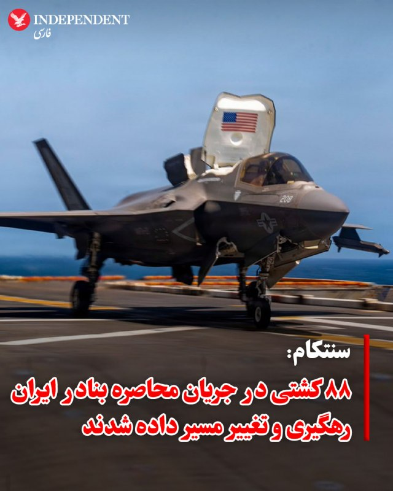

♦️ فرماندهی مرکزی ایالات متحده (سنتکام) روز سه‌شنبه ۲۹ اردیبهشت اعلام کرد از زمان آغاز محاصره بنادر ایران و شناورهای وابسته به جمهوری اسلامی، نیروهای نظامی آمریکا مسیر ۸۸ کشتی تجاری را تغییر داده‌اند. این آمار جدید نشان‌دهنده افزایش شمار شناورهای توقیف یا رهگیری شده نسبت به رقم ۸۵ فروندی است که سنتکام تا روز دوشنبه گزارش داده بود.

سنتکام در پیامی در شبکه اجتماعی ایکس تاکید کرد که از آغاز این محاصره، نیروهای آمریکایی همچنین ۴ کشتی را «برای تضمین پایبندی کامل به ضوابط محاصره» زمین‌گیر و متوقف کرده‌اند. محاصره بنادر و کشتی‌های ایرانی از سوی آمریکا و در مقابل، تهدید کشتی‌رانی در تنگه هرمز از سوی جمهوری اسلامی، این شاهراه حیاتی جهان را به بن‌بست کشانده و باعث جهش شدید قیمت جهانی انرژی شده است.
‌🇸🇦 Indypersian

🤖 @VahidOOnLine

## VahidOOnLine — post 240964

  

سازمان بنادر عربستان سعودی سه‌شنبه اعلام کرد که «خط کشتیرانی سریع دریای سرخ» را در بندر صنعتی ملک فهد در ینبع راه‌اندازی کرده است تا روند جابه‌جایی بار را تسریع کند، زمان انتظار را کاهش دهد و کارایی لجستیکی در این بندر را افزایش دهد.

این سرویس بنادر جده، ینبع، عین‌السخنه در مصر، و عقبه در اردن را به یکدیگر متصل می‌کند.

ظرفیت این سرویس جدید ۱ هزار و ۱۰۰ کانتینر استاندارد است.

بندر صنعتی ملک فهد، واقع در ینبع در ساحل دریای سرخ، یکی از بزرگ‌ترین بنادر برای بارگیری نفت خام و محصولات پتروشیمی در دریای سرخ است.

عربستان سعودی برای جبران توقف تقریبا کامل تردد از طریق تنگه هرمز در جریان جنگ ایران، ارسال محموله‌ها از طریق ینبع را افزایش داده است.
‌🏁 🇬🇧 IranintlTV

🤖 @VahidOOnLine

## VahidOOnLine — post 240963

  

♦️جشنواره فیلم کن ۲۰۲۶ در فرش قرمز شامگاه ۲۸ اردیبهشت (۱۸ مه) با بارش ناگهانی باران بهاری غافلگیر شد؛ بارانی که برای دقایقی حال‌وهوای همیشگی فرش قرمز را تغییر داد و ورود ستاره‌ها را با چتر، دویدن میان قطره‌های باران و تلاش برای رسیدن به پله‌های کاخ جشنواره همراه کرد.
با وجود بارش شدید، بسیاری از مهمانان ترجیح دادند بی‌توجه به باران مقابل دوربین عکاسان توقف کنند و ژست بگیرند؛ صحنه‌ای که به یکی از تصاویر متفاوت جشنواره امسال تبدیل شد.
‌🇸🇦 Indypersian

🤖 @VahidOOnLine

## VahidOOnLine — post 240962

♦️در ادامه تبلیغات حکومتی در دوران آتش‌بس و تلاش جمهوری اسلامی برای مدیریت فضای رسانه‌ای، در چندین شهر ایران مراسم عروسی خیابانی برگزار شد و عروس و دامادها سوار بر خودروهای جنگی مجهز به تیربار دوشکا در خیابان‌ها رژه رفتند.

خبرگزاری فرانسه تصاویری منتشر کرده است که نشان می‌دهد خودروها با بادکنک‌های سفید و صورتی تزئین شده‌اند و کاروان‌های عروسی با بوق‌زدن و حرکت در خیابان‌ها، تجمع‌های شبانه حکومتی را همراهی می‌کنند. در بخشی از این مراسم نیز یک جیپ و ماکت صورتی‌رنگ موشک «خیبرشکن» دیده می‌شود.

بر اساس این تصاویر، عروس و دامادهای ایرانی در مراسم ازدواج جمعی در میدان امام حسین تهران، سوار بر خودروهای نظامی در یک رژه خیابانی شرکت کردند.
‌🇸🇦 Indypersian

🤖 @VahidOOnLine

## VahidOOnLine — post 240961

  

خبرگزاری آسوشیتدپرس با استناد به تصاویر ماهواره‌ای تایید کرد در جریان حملات علیه جمهوری اسلامی، نشت نفت در آب‌های خلیج فارس به سواحل جزیره شیدور سرایت کرده است. این خبرگزاری نوشت حمله به پالایشگاه لاوان عامل این آلودگی بوده است.

در روزهای گذشته ویدیویی در شبکه‌های اجتماعی منتشر شد که در آن پرنده و خرچنگی بی‌جان پوشیده از نفت در ساحل جزیره دیده می‌شوند و مردی نیز ماهی مرده‌ای را نشان می‌دهد.

تصاویر ثبت‌شده در ۱۰ آوریل توسط ماهواره با وضوح بالا و تحلیل‌شده از سوی آسوشیتدپرس نشان می‌دهد آتش‌سوزی پالایشگاه لاوان دو روز پس از حمله همچنان ادامه داشته است. همچنین لکه نفتی گسترده‌ای آب‌های اطراف را آلوده کرده و جزیره شیدور، که با نام محلی مارو نیز شناخته می‌شود، را دربر گرفته است.
‌🏁 🇬🇧 IranintlTV

🤖 @VahidOOnLine

## VahidOOnLine — post 240960

  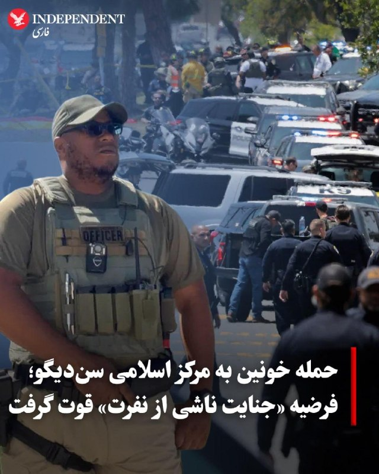

در پی تیراندازی مرگبار روز دوشنبه ۲۸ اردیبهشت، در بزرگ‌ترین مسجد و مرکز اسلامی شهر سن‌دیگو، سه نفر جان خود را از دست دادند. این حادثه در مجتمع آموزشی این مرکز رخ داد. در میان جان‌باختگان، نام امین عبدالله، نگهبان این مرکز و پدر هشت فرزند، تایید شده است.

نیروهای پلیس مدتی بعد جسد دو نوجوان را در خودرویی نزدیکی محل حادثه پیدا کردند که شواهد اولیه از خودکشی آن‌ها حکایت دارد. یکی از این افراد کین کلارک ۱۷ ساله شناسایی شده است. نکته حائز اهمیت در این پرونده، هشدار مادر کلارک به پلیس ساعاتی پیش از وقوع فاجعه است؛ او گزارش داده بود که پسرش به همراه فرد دیگری، با لباس‌های استتار و سه قبضه سلاح ناپدید شده‌اند و تمایلات خودکشی دارند.

مقامات قضایی و پلیس سن‌دیگو با استناد به نوشته‌های کشف‌شده روی یکی از سلاح‌ها و یادداشت خودکشی که حاوی مضامین برتری نژادی و نفرت‌پراکنی بوده، این حمله را به عنوان یک جنایت ناشی از نفرت تحت پیگرد قرار داده‌اند. اگرچه در این دست‌نوشته‌ها تهدید مستقیمی علیه این مسجد خاص مطرح نشده بود، اما گستردگی محتوای نژادپرستانه آن، ورود تیم‌های تخصصی اف‌بی‌آی و دادستان‌های ایالتی را به پرونده به همراه داشته است تا احتمال وجود همدستان یا شبکه‌های مرتبط با مظنونان به دقت بررسی شود. در حادثه‌ای همزمان، شلیک به سمت یک باغبان در موقعیتی دیگر نیز گزارش شد که به شکلی معجزه‌آسا، برخورد گلوله به کلاه ایمنی مانع از مرگ او
‌🇸🇦 Indypersian

🤖 @VahidOOnLine

## VahidOOnLine — post 240959

  

کارزار «سه‌شنبه‌های نه به اعدام» اعلام کرد زندانیان معترض به مجازات اعدام، سه‌شنبه ۲۹ اردیبهشت برای صدوبیست‌ویکمین هفته متوالی در ۵۶ زندان ایران دست به اعتصاب غذا زدند. این اقدام در شرایط تشدید موج اعدام‌ها و افزایش نگرانی‌های جهانی درباره وضعیت حقوق بشر در ایران انجام شد.

در بیانیه این کارزار آمده است حکومت جمهوری اسلامی در هفته‌های اخیر، هم‌زمان با گسترش فضای امنیتی و حضور نیروهای وابسته به حکومت در خیابان‌ها، بر اجرای احکام اعدام نیز افزوده است.

این کارزار، به اعدام عبدالجلیل شه‌بخش، زندانی سیاسی بلوچ، در زندان زاهدان و همچنین محمد عباسی، از بازداشت‌شدگان اعتراضات دی‌ماه ۱۴۰۴، اشاره کرد و در بیانیه خود نوشت که حکومت با استفاده از مجازات اعدام، در پی «ایجاد ترس و وحشت در جامعه» است.

کارزار «سه‌شنبه‌های نه به اعدام» تاکید کرد که اعدام صرفا یک مجازات قضایی نیست، بلکه «مهم‌ترین ابزار سرکوب و قتل حکومتی» است که برای وادار کردن جامعه به سکوت و تسلیم به کار گرفته می‌شود.

ادامه این گزارش را در وبسایت ایران‌اینترنشنال بخوانید
‌🏁 🇬🇧 IranintlTV

🤖 @VahidOOnLine

## VahidOOnLine — post 240958

  

سنتکام تصویری از یک ملوان نیروی دریایی آمریکا بر عرشه ناو هواپیمابر آبراهام لینکلن منتشر کرد که در حال عبور از دریای عرب نگهبانی می‌داد. سنتکام نوشت نیروهای این فرماندهی برای اطمینان از اجرای کامل مقررات، ۸۸ کشتی تجاری را تغییر مسیر داده و چهار کشتی را از کار انداخته‌اند.
‌🏁 🇬🇧 IranintlTV

🤖 @VahidOOnLine

## WithYashar — post 11664

ترامپ درباره ایران:

آن‌ها التماس می‌کنند که معامله‌ای انجام دهند.
ممکن است مجبور شویم ضربه بزرگی دیگر به آن‌ها بزنیم. هنوز مطمئن نیستم.
خیلی زود خواهید فهمید.
@withyashar

## WithYashar — post 11663

  <a href="telegram/content/WithYashar_11663_1779202151.mp4" target="_blank">🎬 Download video</a>

پرزیدنت ترامپ: من از به‌کار بردن کلمه “تک‌تیرانداز” خوشم نمی‌آید، اما ما توانایی خیلی خوبی در تک‌تیراندازی داریم.
@withyashar

## WithYashar — post 11662

  <a href="telegram/content/WithYashar_11662_1779202153.mp4" target="_blank">🎬 Download video</a>

در همین لحظه لایو بازدید پرزیدنت ترامپ از مراحل ساخت سالن رقص کاخ سفید
@withyashar

## WithYashar — post 11660

یا هر کسی یه تیکه پارچه اون رنگی‌ داشته باشه ، یا یه پرچم بزرگ رو تیکه تیکه کنند و ببرند 😬🔥
@withyashar

## WithYashar — post 11659

اتاق جنگ با یاشار : کاری‌ نداره اگه همه با هم متحد باشن میتونن ، فقط با پوشیدن لباس های سبز سفید ، قرمز و زرد یه ابر پرچم قول آسای انسانی‌ پیکسلی درست کنند 🧠😍🙌🏾
@withyashar

## WithYashar — post 11658

فیفا با آخوندا بست و با ممنوعیت ورود پرچم های غیر رسمی موافقت کرد
@withyashar

## WithYashar — post 11657

ریکلین فاش خبرنگار اسرائیلی:

نیروهای ویژه ارتش اسرائیل دارن برای نفوذ به تأسیسات هسته ایی اصفهان تمرین می‌کنن تا اورانیوم غنی‌شده رو خارج کنن
مواد هسته‌ای اون‌قدرا هم عمیق دفن نشده و بعد از ورود به سایت، میشه منتقلش کرد
@withyashar

## WithYashar — post 11656

  <a href="telegram/content/WithYashar_11656_1779202154.mp4" target="_blank">🎬 Download video</a>

سنتکام : ‏هزاران آمریکایی شجاع در لباس نظامی همچنان در سراسر خاورمیانه خدمت می‌کنند.
@withyashar

## WithYashar — post 11655

فرماندهی مرکزی ایالات متحده: 88 کشتی را در جریان محاصره دریایی ایران مجبور به تغییر مسیر کردیم.
@withyashar

## WithYashar — post 11654

ارتش اسرائیل : در ساعات اخیر، ۲۵ انبار و سکوی پرتاب موشک متعلق به حزب‌الله را در جنوب لبنان نابود کردیم
@withyashar

## WithYashar — post 11653

یک منبع آمریکایی به الجزیره:

بحث امنیتی که برای امروز در کاخ سفید درباره ایران برنامه‌ریزی شده بود، پس از اعلام ترامپ مبنی بر تعویق حمله برنامه‌ریزی شده، به تعویق افتاد
@withyashar

## WithYashar — post 11652

زلزله لرستان 4.6 ریشتر
@withyashar

## WithYashar — post 11651

رئیس روس اتم: قادریم برنامه بازگرداندن کارکنان نیروگاه بوشهر را اجرایی کنیم
@withyashar

## WithYashar — post 11650

سازمان عفو بین‌الملل اعلام کرد تعداد اعدام‌ها در جهان طی سال 2025 به بالاترین سطح در 44 سال گذشته رسیده.

طبق این گزارش، جمهوری اسلامی اصلی‌ترین عامل افزایش آمار اعدام‌ها در جهان بوده.
@withyashar

## WithYashar — post 11649

رویترز: پیشنهاد جدید ایران به آمریکا برای پایان درگیری‌ها :

- عقب نشینی نیروهای آمریکایی از منطقه
- پرداخت غرامت توسط آمریکا
- رفع تحریم‌ها
- آزادسازی اموال بلوکه شده توسط آمریکا
- پایان محاصره آمریکا علیه بنادر
@withyashar

## WithYashar — post 11648

معاون امنیتی استان خوزستان :

امروز داشتیم پدافند هامونو تست میکردیم که به اشتباه یکی از پرتابه ها خورد به یک ساختمون مسکونی و چندین نفر زخمی شدن.
@withyashar

## mwarmonitor — post 9309

🚨«وزارت دفاع امارات متحده عربی اعلام کرد که طی ۴۸ ساعت گذشته شش پهپاد را که از عراق شلیک شده بودند، شناسایی و رهگیری کرده است.»

@mwarmonitor

## mwarmonitor — post 9308

🔴«ناتو در حال بررسی امکان کمک به عبور کشتی‌ها از تنگه هرمزِ مسدودشده است، در صورتی که این آبراه تا اوایل ماه ژوئیه بازگشایی نشود.

🔸به گفته یک مقام ناتو، حمایت از انجام چنین مأموریتی رو به افزایش است، هرچند برخی از اعضا همچنان تمایلی ندارند که بیش از این درگیر این درگیری شوند.»

— سازمان پیمان آتلانتیک شمالی (ناتو) | بلومبرگ

@mwarmonitor

## mwarmonitor — post 9307

🔴«پیشنهاد جدید ایران به ایالات متحده برای پایان دادن به جنگ شامل موارد زیر است:

🔸خروج نیروهای آمریکایی از مناطق نزدیک به ایران

🔸پرداخت غرامت‌های جنگی از سوی آمریکا

🔸لغو تحریم‌ها علیه ایران

🔸آزادسازی دارایی‌های مسدودشده ایران

🔸پایان دادن به محاصره (بلاکاد) آمریکا

رویترز

@mwarmonitor

## mwarmonitor — post 9306

  

🔴دریاسالار برد کوپر، فرمانده فرماندهی مرکزی ایالات متحده (سنتکام)، قرار است صبح امروز درباره وضعیت و آرایش سنتکام در برابر کمیته نیروهای مسلح مجلس نمایندگان آمریکا شهادت بدهد.

🔴 پخش زنده: از طریق یوتیوب

@mwarmonitor

## mwarmonitor — post 9305

🔴 «وزیر خزانه‌داری آمریکا : انتظار می‌رود شرکای اروپایی از تحریم‌های اعمال‌شده علیه ایران حمایت کنند؛ از جمله با جلوگیری از فعالیت تأمین‌کنندگان مالی آن، بستن شعب بانکی‌اش و افشای شرکت‌های پوششی آن.»

@mwarmonitor

## FoxNewsTwitter — post 341932

  <a href="telegram/content/FoxNewsTwitter_341932_1779202156.mp4" target="_blank">🎬 Download video</a>

Fox News (Twitter/X)

"All of this was paid for by myself."

President Trump shows off the construction site of the historic White House ballroom, stressing the project is being funded as a gift — not by taxpayers.

"This is a gift to the United States of America. and more than a gift. It's going to be one of the most beautiful buildings that's ever been built in the country. In Washington, D.C."

## FoxNewsTwitter — post 341931

  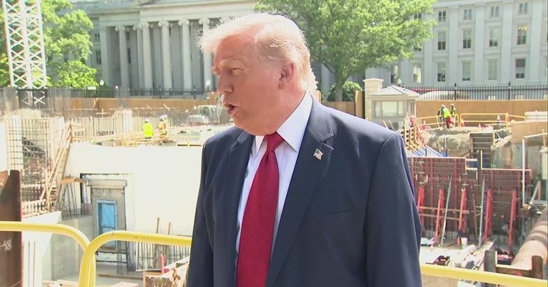

Fox News (Twitter/X)

WATCH LIVE: Trump speaks about the White House ballroom construction https://twitter.com/i/broadcasts/1OxwblrkApEJB

## FoxNewsTwitter — post 341930

  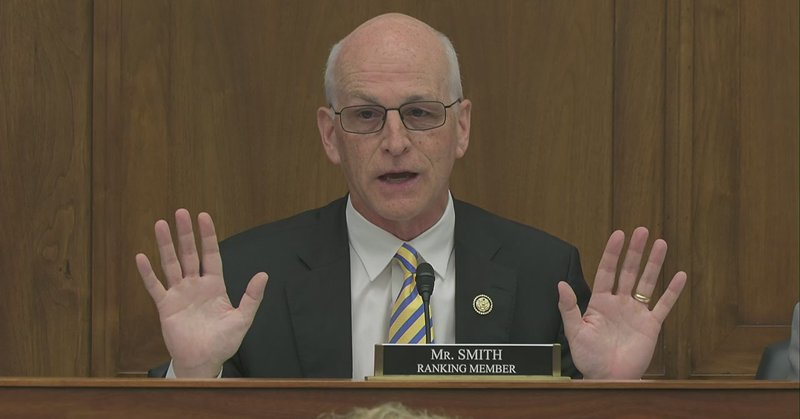

Fox News (Twitter/X)

WATCH LIVE: House Armed Services Committee grills Pentagon officials https://twitter.com/i/broadcasts/1rGmqoMEdoVGy

## FoxNewsTwitter — post 341929

  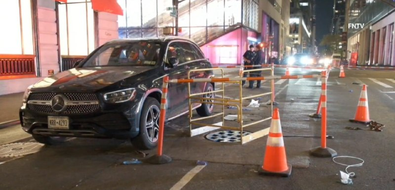

Fox News (Twitter/X)

NEW: A 56-year-old woman plunged to her death after falling into an open manhole while getting out of her car in Midtown Manhattan.

Emergency crews rushed her to the hospital, where she was later pronounced dead.

Authorities are now investigating how the manhole was left uncovered in one of the busiest parts of New York City.

## FoxNewsTwitter — post 341928

  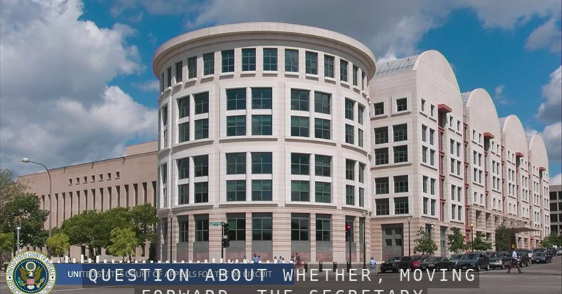

Fox News (Twitter/X)

WATCH LIVE: Federal appeals court hears Anthropic challenge to Pentagon crackdown https://twitter.com/i/broadcasts/1aKbdbaQqvqJX

## FoxNewsTwitter — post 341927

  

Fox News (Twitter/X)

WATCH LIVE: Acting AG Todd Blanche faces lawmakers at first Senate hearing since taking over DOJ https://twitter.com/i/broadcasts/1AKEmOpZDMoKL

## FoxNewsTwitter — post 341926

  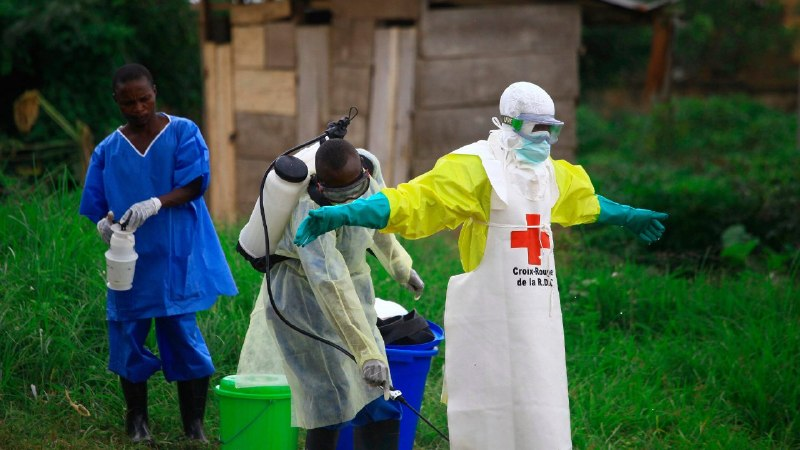

Fox News (Twitter/X)

The head of the World Health Organization warning over 130 people have already died of suspected Ebola cases around the world since the latest outbreak began.

The W.H.O. also sounding the alarm about the rapid "scale and speed" of the surging Ebola infections in eastern Congo and Uganda, with over 500 suspected cases.

This comes after an American man working as a medical missionary in the Democratic Republic of Congo tested positive for the deadly virus.

## FoxNewsTwitter — post 341925

  

Fox News (Twitter/X)

A $1.776 BILLION federal fund is being created for Americans who say they were politically targeted by the government.

The DOJ agreed to launch the “Anti-Weaponization Fund” as part of a settlement after President Trump and his sons sued the IRS for $10 billion over alleged political targeting, misconduct, and abuse of power.

Trump agreed to drop the lawsuit. The DOJ agreed to issue a formal apology. Trump and his sons cannot receive money from the fund.

Supporters say it’s long-overdue. Critics say taxpayers could end up funding it with unclear standards.

The bigger question: Should the federal government compensate people who claim they were politically targeted — and who gets to decide where that line is?

## FoxNewsTwitter — post 341924

  <a href="telegram/content/FoxNewsTwitter_341924_1779202161.mp4" target="_blank">🎬 Download video</a>

Fox News (Twitter/X)

NEW: U.S. Attorney Jeanine Pirro threatens to lock up parents and children over violent “teen takeovers” that are spreading across the nation’s capital.

“Parents have a fundamental responsibility to control their children. It's their children, not the government's children.”

“If parents do not step up and stand in the place of their children, then we're going to prosecute the parents and the children... I've got a lot of opportunities to go after these parents, and no one is going to stop me from doing that.” | @foxandfriends

## FoxNewsTwitter — post 341923

  <a href="telegram/content/FoxNewsTwitter_341923_1779202163.mp4" target="_blank">🎬 Download video</a>

Fox News (Twitter/X)

“We’re very much trying to run an NFL model.”

Bill Belichick explains on "Hang Out With Sean Hannity" why he left the NFL for North Carolina, saying he always wanted to coach in college but never had the opportunity until UNC came calling.

Belichick says the program is being rebuilt with a pro-style structure — complete with a general manager, scouting department, player development system, strength program, and recruiting operation modeled after the NFL.

At one point, he says the goal is bigger than just wins: helping players develop into future NFL talent while turning UNC into what many fans believe it “should be” as a football program.

You can watch the full interview Tuesday at 10am eastern. | @seanhannity

## FoxNewsTwitter — post 341922

  <a href="telegram/content/FoxNewsTwitter_341922_1779202165.mp4" target="_blank">🎬 Download video</a>

Fox News (Twitter/X)

Music’s biggest stars are set to gather next week for the 52nd annual American Music Awards in Las Vegas.

Whose song will win the American Music Award for Song of the Year?

Our sponsor Kalshi’s prediction market shows:
— Back to Friends: 81%
— Golden: 35%
— The Fate of Ophelia: 34%

@foxandfriends

## FoxNewsTwitter — post 341921

  

Fox News (Twitter/X)

WATCH LIVE: NTSB holds hearing on deadly UPS cargo plane crash https://twitter.com/i/broadcasts/1AxRnaOWzmjxl

## pm_afshaa — post 91030

  <a href="telegram/content/pm_afshaa_91030_1779202167.webm" target="_blank">🎬 Download video</a>

🔴وزیر خزانه‌داری آمریکا:
بیش از نیم میلیارد دلار ارز دیجیتال مرتبط با ایران رو مسدود کردیم.

💧 Rainbet.com the #1 Non-KYC Crypto Casino & Sportsbook @rainbetcom

😁 @Pm_Afshaa

## pm_afshaa — post 91029

  <a href="telegram/content/pm_afshaa_91029_1779202167.webm" target="_blank">🎬 Download video</a>

🔴آسوشیتدپرس با استناد به تصاویر ماهواره‌ای تایید کرد نشت نفت ناشی از حمله به پالایشگاه لاوان، آب‌های اطراف جزیره شیدور رو آلوده کرده.

آتش‌سوزی پالایشگاه حتی دو روز بعد از حمله ادامه داشته و تصاویر منتشرشده هم حیوانات و آبزیان پوشیده از نفت و تلف‌شده رو در سواحل جزیره نشان میده.

💧 Rainbet.com the #1 Non-KYC Crypto Casino & Sportsbook @rainbetcom

😁 @Pm_Afshaa

## pm_afshaa — post 91028

🔴وزیر خزانه‌داری آمریکا : دنبال سرکوب جهانی شبکه‌های بانکداری مخفی ایرانیم

💧 Rainbet.com the #1 Non-KYC Crypto Casino & Sportsbook @rainbetcom

😁 @Pm_Afshaa

## pm_afshaa — post 91027

  <a href="telegram/content/pm_afshaa_91027_1779202168.webm" target="_blank">🎬 Download video</a>

🔴سازمان عفو بین‌الملل اعلام کرد تعداد اعدام‌ها در جهان طی سال 2025 به بالاترین سطح در 44 سال گذشته رسیده.

طبق این گزارش، جمهوری اسلامی اصلی‌ترین عامل افزایش آمار اعدام‌ها در جهان بوده.

💧 Rainbet.com the #1 Non-KYC Crypto Casino & Sportsbook @rainbetcom

😁 @Pm_Afshaa

## pm_afshaa — post 91026

  <a href="telegram/content/pm_afshaa_91026_1779202168.webm" target="_blank">🎬 Download video</a>

🔴رویترز: پیشنهاد جدید ایران به آمریکا برای پایان درگیری‌ها :

- عقب نشینی نیروهای آمریکایی از منطقه
- پرداخت غرامت توسط آمریکا
- رفع تحریم‌ها
- آزادسازی اموال بلوکه شده توسط آمریکا
- پایان محاصره آمریکا علیه بنادر

💧 Rainbet.com the #1 Non-KYC Crypto Casino & Sportsbook @rainbetcom

😁 @Pm_Afshaa

## pm_afshaa — post 91025

🔴تایمز انگلیس: اگه تنگه هرمز بسته بمونه، دنیا خیلی سریع داره میره سمت یه بحران جهانی غذا

💧 Rainbet.com the #1 Non-KYC Crypto Casino & Sportsbook @rainbetcom

😁 @Pm_Afshaa

## pm_afshaa — post 91023

زلزله شدید در خرم اباد لرستان

💧 Rainbet.com the #1 Non-KYC Crypto Casino & Sportsbook @rainbetcom

😁 @Pm_Afshaa

## pm_afshaa — post 91022

  <a href="telegram/content/pm_afshaa_91022_1779202169.webm" target="_blank">🎬 Download video</a>

🔴وال استریت ژورنال: برخلاف صحبت‌های ترامپ کشور های عربی اعلام کردند از برنامه آمریکا برای حمله به ایران خبر نداشتند!

💧 Rainbet.com the #1 Non-KYC Crypto Casino & Sportsbook @rainbetcom

😁 @Pm_Afshaa

## pm_afshaa — post 91021

حیاتی، معاون امنیتی خوزستان :امروز تو اندیمشک داشتیم سامانه پدافند هوایی رو تست می‌کردیم که یه پرتابه‌اش به یه ساختمون مسکونی خورد و 4 نفر زخمی شدن

💧 Rainbet.com the #1 Non-KYC Crypto Casino & Sportsbook @rainbetcom

😁 @Pm_Afshaa

## DEJradio — post 4736

  <a href="telegram/content/DEJradio_4736_1779202169.mp4" target="_blank">🎬 Download video</a>

🔺📢 پیام یک شهروند:
ما چیزی برای خوردن نداریم...

#تورم #فقر
@DEJradio

## DEJradio — post 4735

  <a href="telegram/content/DEJradio_4735_1779202171.webm" target="_blank">🎬 Download video</a>

🚨📢 طبق اعلام مدیرکل تعزیرات حکومتی استان فارس، ۹۰۰ تُن مرغ منجمد احتکار شده در یکی از سردخانه‌های شیراز کشف شد.

احتکار حجم سنگینی از مواد خوراکی سودجویی سازمان یافته است که نمی‌تواند بدون پشتوانه بالادستی باشد. این در حالی است که مراجع قضایی حکومت بارها در مورد برخورد با احتکار هشدار داده بودند و برای مقابله با آن قرارگاه ویژه تاسیس شده است.
احتکار از عوامل اصلی کمیابی کالا و گرانی است.

#فارس #احتکار_مرغ
@DEJradio

## DEJradio — post 4734

🚨 هر توافقی با جمهوری اسلامی باید به تأیید کنگرۀ آمریکا برسد

لیندزی گراهام، سناتور جمهوری‌خواه آمریکایی تأکید کرد هر توافقی میان واشینگتن و جمهوری اسلامی باید برای تأیید به کنگره ارائه شود.
او همچنین خواستار پایان غنی‌سازی اورانیوم و توقف پشتیبانی جمهوری اسلامی از گروه‌های نیابتی شد.
دونالد ترامپ اعلام کرده حملۀ برنامه‌ریزی‌شده علیه جمهوری اسلامی را به درخواست رهبران چند کشور عربی به تعویق انداخته است.

#ترامپ #توافق #لیندسی_گراهام
@DEJradio

## DEJradio — post 4733

  <a href="telegram/content/DEJradio_4733_1779202171.webm" target="_blank">🎬 Download video</a>

🚨📢 ‏بر اساس گزارش منابع میدانی روز سه‎شنبه ۲۹ اردیبهشت ۱۴۰۵ توپ‌های ضدهوایی و راکت‌های پدافند در یزد، دزفول، بوشهر، اهواز و اندیمشک فعال شدند. منابع محلی می‌گویند در آسمان صدای پهپاد شنیدند. هنوز به طور رسمی اعلام نشده است که چرا پدافند فعال شد اما شامگاه دوشنبه ۲۸ اردیبهشت نیز گزارش شد که در بعضی شهرها پدافند فعال شد.

استانداری خوزستان اعلام کرده است که به علت سقوط پرتابه در اندیمشک چهار نفر مجروح شدند. گفته می‌شود این پرتابه مهمات پدافند خودی بوده که روی خانه‌های مردم سقوط کرده است.

#خوزستان #پدافند
@DEJradio

## VahidOnline — post 75554

  <a href="telegram/content/VahidOnline_75554_1779202171.mp4" target="_blank">🎬 Download video</a>

در پی کارزار ایران‌اینترنشنال برای یافتن هویت پیکر جاویدنامان در بیمارستان الغدیر تهران، ویدیویی از لحظه قتل جاویدنام آیدا عقیلی به دست ما رسیده است.
آیدا عقیلی، ۳۴ ساله، شامگاه ۱۸ دی ۱۴۰۴ در شرق تهران با شلیک دو گلوله ماموران به سرش کشته شد که پیکر او را پیچیده در پتویی چهارخانه در حیاط پشتی بیمارستان الغدیر یافتند.
@VahidOOnLine

مربوط به این تصاویر تکان‌دهنده: @VahidOnline
این ویدیوی دلخراش: @VahidOnline
اعتراض‌های چهارشنبه ۱۷ دی:@VahidOnline

#بیمارستان_الغدیر
📡 @VahidOnline

## VahidOnline — post 75553

  

آرش زاد:
آمار نشون می‌ده در سه ماه گذشته یک پاکسازی طبقاتی دیجیتال در ایران رخ داده. در این مدت سهم اندروید از ترافیک اینترنت ۲۵٪ افت و آیفون ۱۸۰٪ رشد داشته. این به معنی خروج میلیون‌ها کاربر طبقه متوسط و پایین از فضای آنلاینه. اونی که آیفون داره از پس هزینه کانفیگ یا اینترنت پرو برمیاد، اونی که نداره، اونقدر دغدغه مالی مختلف داره که عطای اینترنت رو به لقاش می‌بخشه.

## VahidOnline — post 75552

  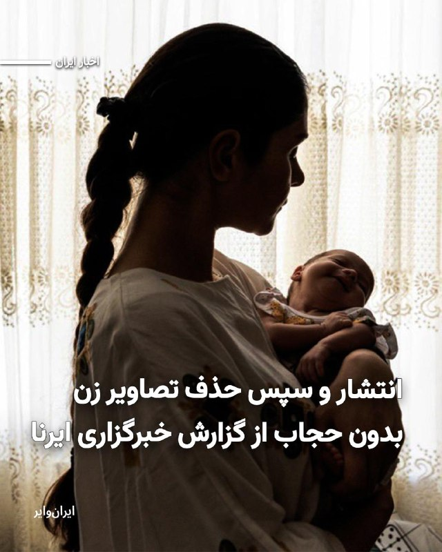

خبرگزاری دولتی ایرنا در گزارشی تصویری با عنوان «مهر مادری به عمر چهل روز»، داستان زنی را منتشر کرد که در جریان جنگ ۴۰ روزه، سرپرستی یک نوزاد رهاشده در بیمارستان را برعهده گرفته است.

در این گزارش، برای نخستین‌بار تصاویری از یک زن ایرانی بدون پوشش سر منتشر شد؛ موضوعی که بازتاب گسترده‌ای در افکار عمومی یافت.

با این حال، دقایقی پس از انتشار این گزارش، چهار تصویری که در آن زن بدون پوشش سر دیده می‌شد، از خروجی وب‌سایت ایرنا حذف شد.
@VahidHeadline

📡 @VahidOnline

## VahidOnline — post 75551

  

هتل عامری‌های کاشان، یکی از بزرگ‌ترین مجموعه‌های هتلینگ سنتی در این شهر تاریخی، به دلیل آنچه «عدم رعایت حجاب اجباری» عنوان شده، پلمپ شد.
@VahidHeadline
پیش‌تر پیامی دریافت کرده بودم درباره اینکه فقط رستورانش رو بستند.
📡 @VahidOnline

## VahidOnline — post 75550

  

ایووت کوپر، وزیر خارجه بریتانیا روز سه‌شنبه ۲۹ اردیبهشت هشدار داد که جهان دیگر نمی‌تواند بیش از این برای بازگشایی تنگه هرمز صبر کند و ادامه بسته‌ماندن آن امنیت غذایی کشورهای آسیب‌پذیر را با بحران جدی‌تری روبه‌رو می‌کند.

وزارت خارجه بریتانیا روز سه‌شنبه اعلام کرد کوپر در کنفرانس جهانی مشارکت‌ها در لندن، با اشاره به پیامدهای بحران جنگ ایران بر انرژی، کود کشاورزی و قیمت مواد غذایی، خواستار فشار فوری بین‌المللی برای بازگشایی تنگه هرمز شده است.
@VahidHeadline

📡 @VahidOnline

## VahidOnline — post 75549

  

معاون وزیر خارجه ایران می‌گوید تهران در پیشنهادهای اخیر خود به آمریکا برای پایان جنگ میان دو کشور، خواستار برخورداری از حق غنی‌سازی، خاتمه جنگ در تمام جبهه‌ها از جمله لبنان و خروج نیروهای آمریکایی از محیط پیرامونی ایران شده است.

کاظم غریب‌آبادی که روز سه‌شنبه ۲۹ اردیبهشت برای ارائه گزارشی در مورد روند مذاکرات میان تهران و واشینگتن، در کمیسیون امنیت ملی و سیاست خارجی مجلس حاضر شده بود، از دیگر شروط ایران را «رفع محاصرهٔ دریایی آمریکا، آزادسازی اموال و دارایی‌های ایران، تأمین خسارت‌های وارد شده در جنگ توسط ایالات متحده جهت بازسازی و خاتمه تمامی تحریم‌های یکجانبه و قطعنامه‌های شورای امنیت» اعلام کرد.
@VahidHeadline

📡 @VahidOnline

## VahidOnline — post 75548

  

سازمان «کمک به گروگان‌ها در سراسر جهان» دوشنبه شب اعلام کرد شهاب دلیلی، زندانی سیاسی و کاپیتان پیشین شرکت کشتی‌رانی ایران، پس از آزادی از زندان اوین از طریق ایروان به واشینگتن منتقل شده و به خانواده‌اش پیوسته است.
این سازمان اعلام کرد دلیلی پس از گذراندن بیش از یک دهه «بازداشت غیرقانونی» در ایران، اکنون در سلامت کامل قرار دارد.

شهاب دلیلی که ساکن آمریکا بود، سال ۱۳۹۵ خورشیدی برای مراسم خاکسپاری پدرش به تهران سفر کرده بود اما هنگام بازگشت توسط نیروهای امنیتی بازداشت شد.
خانواده او گفته بودند جمهوری اسلامی او را با اتهام‌هایی از جمله «جاسوسی» و «همکاری با دولت متخاصم» به ۱۰ سال حبس محکوم کرده است.
@VahidOOnLine

📡 @VahidOnline

## VahidOnline — post 75547

  

حامد تیزرویان، عکاس حیات‌وحش و فعال محیط زیست، در ساری بازداشت شده است.

به گفته زینب رحیمی، روزنامه‌نگار حوزه محیط زیست، آقای تیزرویان روز ۱۴ اردیبهشت ۱۴۰۵، بازداشت شده و موبایل و دیگر وسایل الکترونیکی او ضبط شده است.

اتهام مطرح‌شده علیه آقای تیزرویان «اجتماع و تبانی با هدف اقدام علیه امنیت ملی» عنوان شده است.
بازداشت او در پی انتشار مطالبی انتقادی درباره کشتار معترضان در دی‌ماه و همچنین اعتراض به اعدام‌ها در شبکه‌های اجتماعی صورت گرفته است.

آقای تیزرویان از عکاسان برجسته و سرشناس حیات وحش است و ثبت عکس‌های کمیاب از حیات وحش ایران از جمله خرس قهوه‌ای و مرال به عنوان گونه‌های‌ در معرض خطر انقراض، بخشی از کارنامه کاری این عکاس حیات وحش است.
@VahidHeadline

📡 @VahidOnline

## kianmeli1 — post 87495

‏🔴والا نیوز: در صورت تصمیم ترامپ برای حمله مجدد به ایران، هماهنگی‌هایی با چند کشور خاورمیانه انجام شده است
https://t.me/kianmeli1

## kianmeli1 — post 87494

‏🔴ارتش اسرائیل اعلام کرد در ۲۴ ساعت گذشته بیش از ۲۵ انبار سلاح، مرکز فرماندهی و زیرساخت حزب‌الله را در جنوب لبنان هدف قرار داده و چند پرتابگر شلیک‌شده به سمت اسرائیل را منهدم کرده است
https://t.me/kianmeli1

## kianmeli1 — post 87493

‏🔴زمین‌لرزه‌ای به بزرگی ۴.۶ شهرستان نورآباد لرستان را لرزاند
https://t.me/kianmeli1

## IranIntlTV — post 337942

  <a href="telegram/content/IranIntlTV_337942_1779202176.mp4" target="_blank">🎬 Download video</a>

سرخط خبرهای سه‌شنبه ۲۹ اردیبهشت
@iranintltv

## IranIntlTV — post 337941

  <a href="telegram/content/IranIntlTV_337941_1779202177.mp4" target="_blank">🎬 Download video</a>

سازمان جهانی بهداشت اعلام کرد با توجه به شتاب شیوع ویروس ابولا، وضعیت اضطراری بین‌المللی برقرار است. دبیرکل سازمان جهانی بهداشت گفت ابعاد و سرعت شیوع، «بسیار نگران‌کننده» و بیش از برآوردهای اولیه است.

گفت‌وگو با مازیار صدری، فوق تخصص مراقبت‌های ویژه
@iranintltv

## IranIntlTV — post 337940

  

وزارت خزانه‌داری آمریکا اعلام کرد واشینگتن تحریم‌های تازه‌ای علیه جمهوری اسلامی اعمال کرده است

وزارت خزانه‌داری آمریکا ۱۲ نفر، از جمله چهار ایرانی، یک مصری، پنج فلسطینی، یک اسپانیایی و یک شهروند ترکیه را در فهرست تحریم‌ها قرار داد.

همچنین ۲۹ شرکت و نهاد و ۱۹ کشتی نیز به فهرست تحریم‌های آمریکا اضافه شدند.
https://iranintl.com/202605198756

## IranIntlTV — post 337939

  

وزارت دفاع امارات متحده عربی اعلام کرد در ۴۸ ساعت گذشته شش پهپاد را شناسایی و با آن‌ها مقابله کرده است.
این وزارتخانه افزود این پهپادها از خاک عراق پرتاب شده بودند.

روز یک‌شنبه نیز وزارت دفاع امارات متحده عربی از مقابله با سه پهپاد شلیک‌شده از مرزهای غربی خبر داد. بر اساس این گزارش، پدافند هوایی این کشور دو فروند از پهپادها را منهدم کرد، اما پهپاد سوم به یک ژنراتور برق در خارج از محدوده داخلی نیروگاه هسته‌ای براکه در منطقه الظفره اصابت کرد.
https://iranintl.com/202605190960

## IranIntlTV — post 337938

  <a href="https://t.me/IranintlTV/337938" target="_blank">📎 Download file</a>

🎧نسخه صوتی دومینو: تکرار چرخه جنگ، محاصره و مذاکره
@iranintlTV

## IranIntlTV — post 337937

  <a href="telegram/content/IranIntlTV_337937_1779202179.mp4" target="_blank">🎬 Download video</a>

دبیر کمیسیون انرژی مجلس اعلام کرد جیره‌بندی بنزین یارانه‌ای و افزایش نرخ بنزین آزاد از اول خرداد اجرا می‌شود. همچنین سهمیه ۵ هزار تومانی از کارت‌های سوخت حذف خواهد شد.
گفت‌وگو با عطا حسینیان، روزنامه‌نگار اقتصادی و حوزه انرژی
@iranintltv

## IranIntlTV — post 337936

  

طبق اطلاعات رسیده به ایران‌اینترنشنال، کریگ فورمن، شهروند بریتانیایی که همراه همسرش، لیندزی فورمن، ۱۷ ماه است در ایران زندانی‌اند، از ۱۰ روز پیش در زندان اوین، در اعتراض به محرومیت از تماس تلفنی، ملاقات با همسرش و دیدار با وکیل، اعتصاب غذا کرده و تنها آب، قند و نمک مصرف می‌کند.

یک منبع آگاه از وضعیت این زندانیان به ایران‌اینترنشنال گفت آن‌ها پس از مصاحبه با بخش جهانی بی‌بی‌سی که در آن درباره دشواری شرایط بسیاری از ایرانیان سخن گفته بودند، از تماس تلفنی و ملاقات با یکدیگر محروم شدند و مقام‌های زندان حتی ملاقات با وکیل را نیز قطع کردند؛ موضوعی که باعث اعتصاب غذای کریگ فورمن شد.

این منبع با اشاره به وضعیت جسمانی او گفت فورمن پس از ۱۰ روز اعتصاب غذا وضعیت مناسبی ندارد و افزود اعتراض او جدا از محرومیت از ملاقات و تماس به این است که با وجود مشاهده انتقال هم‌بندی‌هایش برای اجرای حکم اعدام، اجازه ندارد درباره آنچه در زندان دیده و شرایط خود سخن بگوید.

به گفته این منبع، فورمن بارها گفته مقام‌های زندان و دستگاه قضایی به او «وعده‌های دروغ» می‌دهند و او نمی‌فهمد چرا باید «این همه دروغ» از مسئولان جمهوری اسلامی بشنود.

## IranIntlTV — post 337935

  <a href="telegram/content/IranIntlTV_337935_1779202181.mp4" target="_blank">🎬 Download video</a>

یک شهروند با ارسال پیامی به ایران‌‌اینترنشنال می‌گوید: «مجبورم روزی سه بار بروم در صف پمپ بنزین تا بتوانم ۱۰ لیتر سوخت بگیرم. آن‌وقت در صداوسیما از گرانی بنزین و تورم در آمریکا و اروپا می‌گویند.»

## IranIntlTV — post 337934

  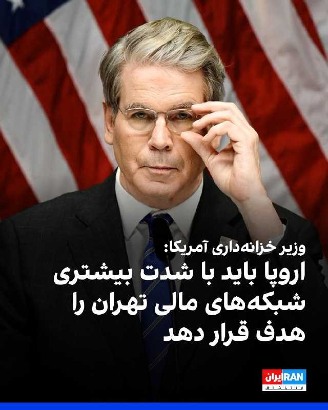

اسکات بسنت، وزیر خزانه‌داری آمریکا، اعلام کرد از متحدان واشینگتن خواسته شده با شدت بیشتری شبکه‌های مالی تهران را هدف قرار دهند.
او گفت کشورهای اروپایی باید برای تحریم تامین‌کنندگان مالی جمهوری اسلامی، شناسایی شرکت‌های پوششی و صوری، بستن شعب بانکی و مقابله با نیروهای نیابتی تهران همکاری کنند.
https://iranintl.com/202605191772

## IranIntlTV — post 337933

  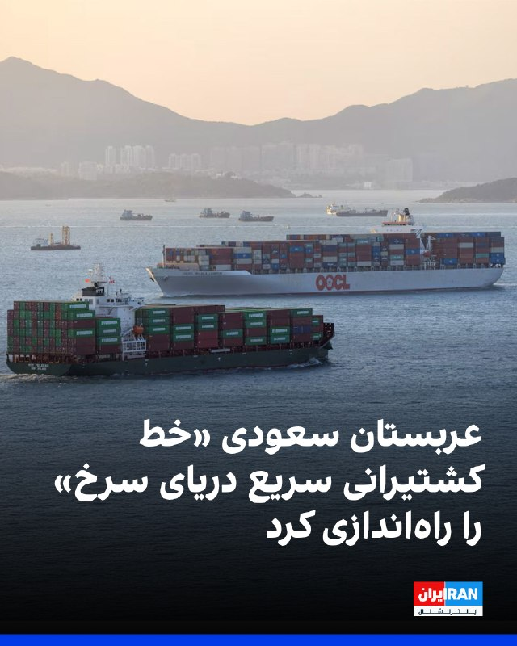

سازمان بنادر عربستان سعودی سه‌شنبه اعلام کرد که «خط کشتیرانی سریع دریای سرخ» را در بندر صنعتی ملک فهد در ینبع راه‌اندازی کرده است تا روند جابه‌جایی بار را تسریع کند، زمان انتظار را کاهش دهد و کارایی لجستیکی در این بندر را افزایش دهد.

این سرویس بنادر جده، ینبع، عین‌السخنه در مصر، و عقبه در اردن را به یکدیگر متصل می‌کند.

ظرفیت این سرویس جدید ۱ هزار و ۱۰۰ کانتینر استاندارد است.

بندر صنعتی ملک فهد، واقع در ینبع در ساحل دریای سرخ، یکی از بزرگ‌ترین بنادر برای بارگیری نفت خام و محصولات پتروشیمی در دریای سرخ است.

عربستان سعودی برای جبران توقف تقریبا کامل تردد از طریق تنگه هرمز در جریان جنگ ایران، ارسال محموله‌ها از طریق ینبع را افزایش داده است.
https://iranintl.com/202605197094

## IranIntlTV — post 337932

  <a href="telegram/content/IranIntlTV_337932_1779202184.mp4" target="_blank">🎬 Download video</a>

شورای امنیت سازمان ملل به‌درخواست بحرین نشست اضطراری برگزار می‌کند. موضوع این جلسه حمله به نیروگاه هسته‌ای براکه در امارات متحده عربی و پیامدهای آن عنوان شده است.
مریم رحمتی، خبرنگار ایران‌اینترنشنال، گزارش می‌دهد
@iranintltv

## IranIntlTV — post 337931

  

خبرگزاری آسوشیتدپرس با استناد به تصاویر ماهواره‌ای تایید کرد در جریان حملات علیه جمهوری اسلامی، نشت نفت در آب‌های خلیج فارس به سواحل جزیره شیدور سرایت کرده است. این خبرگزاری نوشت حمله به پالایشگاه لاوان عامل این آلودگی بوده است.

در روزهای گذشته ویدیویی در شبکه‌های اجتماعی منتشر شد که در آن پرنده و خرچنگی بی‌جان پوشیده از نفت در ساحل جزیره دیده می‌شوند و مردی نیز ماهی مرده‌ای را نشان می‌دهد.

تصاویر ثبت‌شده در ۱۰ آوریل توسط ماهواره با وضوح بالا و تحلیل‌شده از سوی آسوشیتدپرس نشان می‌دهد آتش‌سوزی پالایشگاه لاوان دو روز پس از حمله همچنان ادامه داشته است. همچنین لکه نفتی گسترده‌ای آب‌های اطراف را آلوده کرده و جزیره شیدور، که با نام محلی مارو نیز شناخته می‌شود، را دربر گرفته است.
https://iranintl.com/202605199759

## IranIntlTV — post 337930

  

کارزار «سه‌شنبه‌های نه به اعدام» اعلام کرد زندانیان معترض به مجازات اعدام، سه‌شنبه ۲۹ اردیبهشت برای صدوبیست‌ویکمین هفته متوالی در ۵۶ زندان ایران دست به اعتصاب غذا زدند. این اقدام در شرایط تشدید موج اعدام‌ها و افزایش نگرانی‌های جهانی درباره وضعیت حقوق بشر در ایران انجام شد.

در بیانیه این کارزار آمده است حکومت جمهوری اسلامی در هفته‌های اخیر، هم‌زمان با گسترش فضای امنیتی و حضور نیروهای وابسته به حکومت در خیابان‌ها، بر اجرای احکام اعدام نیز افزوده است.

این کارزار، به اعدام عبدالجلیل شه‌بخش، زندانی سیاسی بلوچ، در زندان زاهدان و همچنین محمد عباسی، از بازداشت‌شدگان اعتراضات دی‌ماه ۱۴۰۴، اشاره کرد و در بیانیه خود نوشت که حکومت با استفاده از مجازات اعدام، در پی «ایجاد ترس و وحشت در جامعه» است.

کارزار «سه‌شنبه‌های نه به اعدام» تاکید کرد که اعدام صرفا یک مجازات قضایی نیست، بلکه «مهم‌ترین ابزار سرکوب و قتل حکومتی» است که برای وادار کردن جامعه به سکوت و تسلیم به کار گرفته می‌شود.

ادامه این گزارش را در وبسایت ایران‌اینترنشنال بخوانید
https://iranintl.com/202605193847

## IranIntlTV — post 337929

  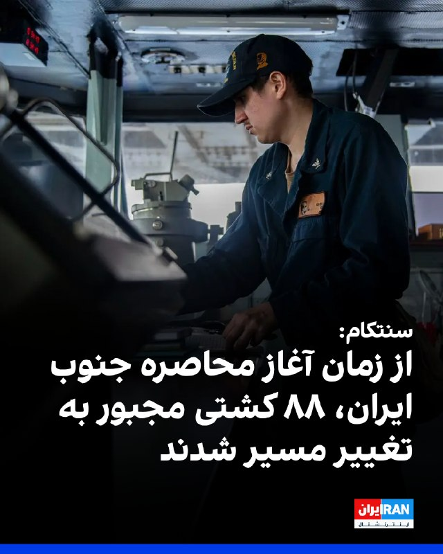

سنتکام تصویری از یک ملوان نیروی دریایی آمریکا بر عرشه ناو هواپیمابر آبراهام لینکلن منتشر کرد که در حال عبور از دریای عرب نگهبانی می‌داد. سنتکام نوشت نیروهای این فرماندهی برای اطمینان از اجرای کامل مقررات، ۸۸ کشتی تجاری را تغییر مسیر داده و چهار کشتی را از کار انداخته‌اند.
https://iranintl.com/202605194310

## IranIntlTV — post 337928

  <a href="telegram/content/IranIntlTV_337928_1779202187.mp4" target="_blank">🎬 Download video</a>

سجاد دهقانی شامگاه ۱۹ دی، در شب تولدش، در سه‌راه برق بندرعباس بر اثر اصابت دو گلوله جان باخت. یک روز پیش از آن نیز، اجمین مسیحی، جوان ۲۷ ساله ارمنی، در میدان هفت‌حوض تهران با شلیک مستقیم کشته شد. شاهدان به ایران‌اینترنشنال گفته‌اند او در صف اول معترضان حضور داشت و پیش از اصابت گلوله شعار «آزادی» سر می‌داد.
جزییات بیشتر با فرنوش فرجی، عضو تحریریه ایران‌اینترنشنال
@iranintltv

## IranIntlTV — post 337927

  <a href="telegram/content/IranIntlTV_337927_1779202188.mp4" target="_blank">🎬 Download video</a>

یکی از شهروندان با ارسال پیامی به ایران‌اینترنشنال می‌گوید: «حکومت در جنگ ۱۲ روزه، ۲۰ روز اینترنت را قطع کرد. در خیزش ملی هم ۲۰ روز، و تا امروز ۸۰ روز است که مجددا نت را قطع کرده. یعنی در یک سال گذشته، چهار ماه است که نت نداریم.»

## IranIntlTV — post 337926

  <a href="telegram/content/IranIntlTV_337926_1779202190.mp4" target="_blank">🎬 Download video</a>

از نمایش تعیین پهپاد شاهد به‌عنوان مهریه یک عروس در تلویزیون جمهوری اسلامی تا آموزش کار با سلاح به کودکان؛ مجموعه‌ای از تصاویر و برنامه‌های مرتبط با فضای جنگ، که واکنش گسترده کاربران شبکه‌های اجتماعی را به‌دنبال داشته است.
آیه دریس، عضو تحریریه ایران‌اینترنشنال، از واکنش کاربران می‌گوید
@iranintltv

## IranIntlTV — post 337925

  

🔻تصویر رسیده به ایران اینترنشنال نشان می‌دهد یکی از هواداران آرسنال در بازی شب گذشته این تیم برابر برنلی، آخرین بازی خانگی توپچی‌ها در این فصل، تصویری از جاویدنام عارف جعفرزاده، هوادار سرسخت تیم فوتبال آرسنال، را که در جریان انقلاب ملی ایرانیان علیه جمهوری اسلامی کشته شد، به دست گرفته است.

🔹پیش‌تر تصاویری منتشر شده بود که نشان می‌داد لوگوی باشگاه آرسنال روی سنگ مزار او حک شده است.

🔹جاویدنام عارف جعفرزاده، ۳۴ ساله و اهل رشت، شامگاه ۱۸ دی ۱۴۰۴ در جریان اعتراضات مردمی هدف شلیک مستقیم گلوله به سر قرار گرفت و جان باخت.

🔹کشته شدن این هوادار آرسنال در فضای هواداری این باشگاه در انگلستان بازتاب گسترده‌ای داشت. نورت‌بنکسی، هنرمند مشهور انگلیسی، گرافیتی جاویدنام جعفرزاده را در «تونل نورت‌بنکسی» در ورودی‌ استادیوم امارات نقاشی کرد.

@iranintltvsport

## IranIntlTV — post 337924

  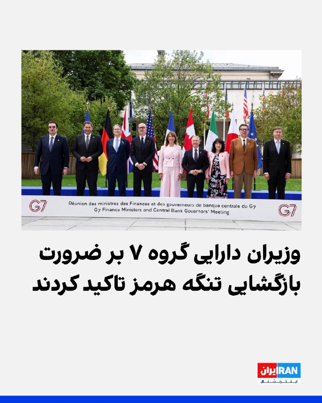

وزیران دارایی کشورهای عضو گروه ۷ که در پاریس گرد هم آمده‌اند، با انتشار بیانیه‌ای مشترک بر ضرورت بازگشایی تنگه هرمز تاکید کردند.

آن‌ها همچنین بار دیگر بر تعهد خود به همکاری‌های چندجانبه برای مقابله با ریسک‌های پیش‌روی اقتصاد جهانی تاکید کردند.

وزیران دارایی کانادا، فرانسه، آلمان، ایتالیا، ژاپن، بریتانیا و ایالات متحده اعلام کردند به حفظ ثبات بازارهای انرژی پایبند هستند و از تمامی کشورها خواستند از اعمال محدودیت‌های خودسرانه بر صادرات خودداری کنند.
https://iranintl.com/202605194425

## IranIntlTV — post 337923

  <a href="https://t.me/IranintlTV/337923" target="_blank">📎 Download file</a>

🎧نسخه صوتی اخبار نیم‌روزی | سه‌شنبه ۲۹ اردیبهشت
@iranintlTV

## Shin_Persian — post 6089

Shin ✓ @hey_itsmyturn
Tue, 19 May 2026 14:31:14 UTC

𝐄𝐜𝐨𝐧𝐨𝐦𝐢𝐜 𝐅𝐮𝐫𝐲 targets Iran's shadow banking system and petroleum smuggling networks, designating over 50 entities including the 𝐀𝐦𝐢𝐧 𝐄𝐱𝐜𝐡𝐚𝐧𝐠𝐞 currency house and 19 vessels that collectively facilitate billions in sanctions evasion revenue.

𝐈𝐍𝐃𝐈𝐕𝐈𝐃𝐔𝐀𝐋𝐒:
• 𝐘𝐨𝐮𝐬𝐞𝐟 𝐄𝐛𝐫𝐚𝐡𝐢𝐦𝐢 (Turkish/Iranian/Dominican national) - Owner and operator of Amin Exchange, maintains multiple citizenships through investment schemes
• 𝐒𝐚𝐦𝐚𝐝 𝐍𝐞𝐦𝐚𝐭𝐢 (Iranian national) - CEO of Amin Exchange and former IRGC officer
• 𝐀𝐥𝐢 𝐇𝐚𝐳𝐫𝐚𝐭𝐢 𝐂𝐡𝐚𝐤𝐡𝐞𝐫𝐥𝐨 (Turkey-based Iranian national) - Board member of Amin Exchange
• 𝐌𝐚𝐡𝐦𝐨𝐮𝐝 𝐄𝐛𝐫𝐚𝐡𝐢𝐦𝐢 (Turkish/Iranian national) - Brother of Yousef Ebrahimi, Amin Exchange employee

𝐄𝐍𝐓𝐈𝐓𝐈𝐄𝐒:
• 𝐄𝐛𝐫𝐚𝐡𝐢𝐦𝐢 𝐚𝐧𝐝 𝐀𝐬𝐬𝐨𝐜𝐢𝐚𝐭𝐞𝐬 𝐏𝐚𝐫𝐭𝐧𝐞𝐫𝐬𝐡𝐢𝐩 𝐂𝐨𝐦𝐩𝐚𝐧𝐲 (𝐀𝐦𝐢𝐧 𝐄𝐱𝐜𝐡𝐚𝐧𝐠𝐞) - Iran-based foreign currency exchange house facilitating hundreds of millions in transactions for sanctioned Iranian banks including NIOC and PGPICC
• 𝐍𝐢𝐧𝐠𝐛𝐨 𝐉𝐢𝐚𝐫𝐮𝐢 𝐓𝐫𝐚𝐝𝐢𝐧𝐠 𝐂𝐨., 𝐋𝐭𝐝. - China-based front company
• 𝐒𝐭𝐚𝐫𝐬𝐡𝐢𝐧𝐞 𝐏𝐞𝐭𝐫𝐨𝐜𝐡𝐞𝐦𝐢𝐜𝐚𝐥 𝐂𝐨𝐫𝐩𝐨𝐫𝐚𝐭𝐢𝐨𝐧 𝐋𝐢𝐦𝐢𝐭𝐞𝐝 - Hong Kong-based front company
• 𝐕𝐢𝐠𝐨𝐫𝐨𝐮𝐬 𝐓𝐫𝐚𝐝𝐢𝐧𝐠 𝐋𝐢𝐦𝐢𝐭𝐞𝐝 - Hong Kong-based front company
• 𝐀𝐥𝐢𝐞𝐞𝐧 𝐆𝐨𝐨𝐝𝐬 𝐖𝐡𝐨𝐥𝐞𝐬𝐚𝐥𝐞𝐫𝐬 𝐋𝐋𝐂 - UAE-based front company
• 𝐁𝐨𝐥𝐝 𝐓𝐫𝐚𝐝𝐢𝐧𝐠 𝐅𝐙𝐄 - UAE-based front company
• 𝐌𝐚𝐭𝐞𝐫𝐢𝐮𝐦 𝐆𝐫𝐨𝐮𝐩 𝐅𝐙𝐄 - UAE-based front company
• 𝐁𝐞𝐬𝐭𝐟𝐨𝐫𝐭𝐮𝐧𝐚 𝐂𝐨𝐦𝐩𝐚𝐧𝐲 𝐋𝐢𝐦𝐢𝐭𝐞𝐝 - Hong Kong-based front company
• 𝐂𝐡𝐞𝐧𝐠 𝐏𝐚𝐧 𝐂𝐨., 𝐋𝐢𝐦𝐢𝐭𝐞𝐝 - Hong Kong-based front company

𝐕𝐄𝐒𝐒𝐄𝐋𝐒 (𝐒𝐡𝐚𝐝𝐨𝐰 𝐅𝐥𝐞𝐞𝐭):
• 𝐆𝐑𝐄𝐀𝐓 𝐒𝐀𝐈𝐋 (IMO 9177583) - Barbados-flagged LPG tanker, owned by Great Sail Shipping Limited
• 𝐎𝐂𝐄𝐀𝐍 𝐖𝐀𝐕𝐄 (IMO 9387152) - Palau-flagged products tanker, owned by Ow Maritime Incorporated
• 𝐒𝐖𝐈𝐅𝐓 𝐅𝐀𝐋𝐂𝐎𝐍 (IMO 9246803) - Panama-flagged chemical/oil tanker, owned by Arden Angel Shipping Company Limited
• 𝐌𝐈𝐆𝐇𝐓𝐘 𝐍𝐀𝐕𝐈𝐆𝐀𝐓𝐎𝐑 (IMO 9206396) - Hong Kong-flagged LPG tanker, owned by Verda Gas Co Ltd
• 𝐌𝐈𝐃𝐀𝐒 (IMO 9266841) - Panama-flagged crude oil tanker, owned by Ocean Marvel Shipping Company Limited
• 𝐁𝐑𝐈𝐆𝐇𝐓 𝐆𝐎𝐋𝐃 (IMO 9171503) - Panama-flagged chemical/oil tanker, owned by GS Chemical Transportation Limited
• 𝐃𝐎𝐔𝐁𝐋𝐄 𝐈𝐍 (IMO 8917807) - San Marino-flagged LPG tanker, owned by Science Obedient International Company Limited
• 𝐍𝐀𝐑𝐒𝐈𝐒 (IMO 9408358) - Cameroon-flagged chemical/oil tanker, owned by Sun Ocean Shipping Incorporated
• 𝐆 𝐉𝐀𝐃𝐄𝐒 (IMO 9131096) - Comoros-flagged LPG tanker, owned by Gjades Shipping Company Limited
• 𝐆𝐀𝐒 𝐄𝐍𝐃𝐔𝐑𝐀𝐍𝐂𝐄 (IMO 9240419) - Gabon-flagged LPG tanker, owned by Aquila Worldwide Marine Developments Corp.
• 𝐎𝐂𝐄𝐀𝐍 𝐑𝐀𝐃𝐈𝐀𝐍𝐂𝐄 (IMO 9194969) - Palau-flagged LPG tanker, owned by Aurora Business Company Limited
• 𝐐𝐔𝐀𝐍𝐓𝐔𝐌 𝐒𝐓𝐀𝐑 (IMO 9225342) - Panama-flagged LPG tanker, owned by Taurus Gas Company Limited
• 𝐆𝐀𝐒 𝐒𝐓𝐑𝐄𝐍𝐆𝐓𝐇 (IMO 9172636) - Panama-flagged LPG tanker, owned by Veinto Global Marine Inc.
• 𝐅𝐄𝐀𝐃𝐒𝐇𝐈𝐏 (IMO 9322279) - Vanuatu-flagged crude oil tanker, owned by Mozart Maritime Inc.
• 𝐕𝐀𝐒𝐋𝐀𝐓𝐈 (IMO 9252333) - Cameroon-flagged crude oil tanker, owned by Splendid Lexy Trading Company Ltd
• 𝐃𝐀𝐊𝐔𝐒𝐇 (IMO 9278698) - Cook Islands-flagged crude oil tanker, owned by Mekong Lines Inc.
• 𝐓𝐄𝐉𝐀𝐒 (IMO 9326067) - Panama-flagged crude oil tanker, owned by Romy Lines Incorporated
• 𝐋𝐔𝐍𝐀 𝐋𝐔𝐒𝐓𝐄𝐑 (IMO 9292187) - Sierra Leone-flagged oil tanker, owned by Global Fortune Shipping Limited
• 𝐆𝐀𝐋𝐀 𝐑𝐎𝐒𝐄 (IMO 9126015) - Hong Kong-flagged chemical/oil tanker, owned by Sparkling Courage Limited

𝐊𝐄𝐘 𝐓𝐄𝐂𝐇𝐍𝐈𝐂𝐀𝐋 𝐃𝐄𝐓𝐀𝐈𝐋𝐒:
• Action taken pursuant to E.O. 13902 targeting Iran's financial, petroleum, and petrochemical sectors
• State Department's Rewards for Justice program offers up to $15 million for information disrupting IRGC financial mechanisms
• Economic Fury has disrupted billions in projected oil revenue and led to freezing of nearly $500 million in regime-linked cryptocurrency
• Treasury warns of potential secondary sanctions on foreign financial institutions, including those connected to China's "teapot" refineries
• All designated vessel-owning companies also sanctioned under petroleum/petrochemical sector authorities

ترجمه فارسی در بخش نظرات

𝕏 · @shin_persian

## Shin_Persian — post 6088

  

وزارة الدفاع |MOD UAE ✓ @modgovae Tue, 19 May 2026 14:12:15 UTC تعلن وزارة الدفاع أنه خلال الـ48 ساعة الماضية تمكنت منظومات الدفاع الجوي الإماراتية من رصد والتعامل بنجاح مع 6 طائرات مسيرة معادية حاولت استهداف مناطق مدنية وحيوية في الدولة. وقد نجحت قوات…

## Shin_Persian — post 6087

وزارة الدفاع |MOD UAE ✓ @modgovae
Tue, 19 May 2026 14:12:15 UTC

تعلن وزارة الدفاع أنه خلال الـ48 ساعة الماضية تمكنت منظومات الدفاع الجوي الإماراتية من رصد والتعامل بنجاح مع 6 طائرات مسيرة معادية حاولت استهداف مناطق مدنية وحيوية في الدولة.

وقد نجحت قوات الدفاع الجوي في اعتراض وتحييد الأهداف المعادية وفق أعلى درجات الجاهزية والكفاءة، دون تسجيل أي خسائر بشرية أو تأثير على سلامة المنشآت الحيوية.

وفي إطار استكمال التحقيقات المتعلقة بالاعتداء السافر على محطة براكة للطاقة النووية بتاريخ 17 مايو 2026، أكدت نتائج التتبع والرصد التقني أن الطائرات المسيرة الثلاث التي تم التعامل بنجاح مع اثنتين منها، فيما أصابت الثالثة مولد كهربائي خارج المحيط الداخلي للمحطة في ذلك التاريخ، بالإضافة إلى الطائرات التي تم اعتراضها لاحقًا، كانت جميعها قادمة من الأراضي العراقية.

وتؤكد وزارة الدفاع أن دولة الإمارات العربية المتحدة تحتفظ بحقها الكامل في اتخاذ كافة الإجراءات اللازمة لحماية سيادتها وأمنها الوطني، وفقًا للقوانين والمواثيق الدولية.

وتشدد وزارة الدفاع على الجاهزية الكاملة للقوات المسلحة للتعامل مع أي تهديدات تستهدف أمن الدولة ومقدراتها الوطنية.

#وزارة_الدفاع
#وزارة_الدفاع_الإماراتية
#MOD
#UAEMinistryOfDefence

English

The Ministry of Defense announces that over the past 48 hours, UAE air defense systems managed to detect and successfully deal with 6 hostile unmanned aerial vehicles (UAVs) that attempted to target civilian and vital areas in the country.

The air defense forces succeeded in intercepting and neutralizing the hostile targets with the highest levels of readiness and efficiency, without recording any human casualties or impact on the safety of vital facilities.

In the context of completing investigations regarding the blatant attack on the Barakah Nuclear Energy Plant on May 17, 2026, technical tracking and monitoring results confirmed that the three drones—two of which were successfully dealt with, while the third struck an electrical generator outside the plant's inner perimeter on that date—as well as the drones intercepted subsequently, all originated from Iraqi territory.

The Ministry of Defense affirms that the United Arab Emirates reserves its full right to take all necessary measures to protect its sovereignty and national security, in accordance with international laws and charters.

The Ministry of Defense emphasizes the full readiness of the Armed Forces to deal with any threats targeting the security of the state and its national assets.

#Ministry_of_Defense
#UAE_Ministry_of_Defense
#MOD
#UAEMinistryOfDefence

𝕏 · @shin_persian

## Shin_Persian — post 6086

Shin ✓ @hey_itsmyturn
Tue, 19 May 2026 13:16:01 UTC

𝐄𝐜𝐨𝐧𝐨𝐦𝐢𝐜 𝐅𝐮𝐫𝐲 campaign intensifies financial pressure on Iran through modernized sanctions architecture targeting terrorist financing networks, with Treasury freezing nearly $500 million in regime-linked cryptocurrency and disrupting hundreds of billions in illicit flows.

𝐊𝐞𝐲 𝐏𝐨𝐥𝐢𝐜𝐲 𝐔𝐩𝐝𝐚𝐭𝐞𝐬:
- Treasury reviewing outdated designations to focus financial institutions on sophisticated evasion schemes
- New approach emphasizes targeted sanctions with defined timelines rather than indefinite measures
- Sanctions architecture modernized for 21st century threats including cryptocurrency and shadow banking

𝐂𝐚𝐦𝐩𝐚𝐢𝐠𝐧 𝐒𝐜𝐨𝐩𝐞 - 𝐄𝐜𝐨𝐧𝐨𝐦𝐢𝐜 𝐅𝐮𝐫𝐲:
- Disrupted tens of billions in projected Iranian oil revenue
- Frozen nearly $500 million in regime-linked cryptocurrency
- Disrupted hundreds of billions in Iran's illicit financial flows
- Intensified crackdown on Tehran's shadow banking networks
- Targeting vessel networks, intermediaries, and oil buyers

𝐈𝐧𝐭𝐞𝐫𝐧𝐚𝐭𝐢𝐨𝐧𝐚𝐥 𝐂𝐨𝐨𝐩𝐞𝐫𝐚𝐭𝐢𝐨𝐧 𝐑𝐞𝐪𝐮𝐢𝐫𝐞𝐦𝐞𝐧𝐭𝐬:
- European partners: Designate Iranian financiers, unmask shell companies, shutter bank branches, dismantle proxies
- Middle East/Asia partners: Root out Iran's shadow banking networks
- Global partners: Target array of terrorists from Hizballah to Sinaloa Cartel

𝐒𝐭𝐫𝐚𝐭𝐞𝐠𝐢𝐜 𝐃𝐨𝐜𝐭𝐫𝐢𝐧𝐞:
- Economic security positioned as national security under Trump Administration
- Sanctions designed as "instruments of peace" to create behavioral change conditions
- Focus on aggressive, targeted actions rather than generational punishment of populations
- Emphasis on agility to maximize effectiveness while monitoring for unintended consequences

𝐎𝐩𝐞𝐫𝐚𝐭𝐢𝐨𝐧𝐚𝐥 𝐓𝐚𝐫𝐠𝐞𝐭𝐬:
- Shell companies embedded within Europe
- Shadow banking networks across Middle East
- Drug cartels throughout Western Hemisphere
- Iranian weapons programs and terrorist proxies
- Nuclear ambitions financing

The announcement reinforces maximum pressure campaign continuation with enhanced multilateral coordination expectations and modernized enforcement mechanisms.

ترجمه فارسی در بخش نظرات

𝕏 · @shin_persian

## Shin_Persian — post 6085

  <a href="telegram/content/Shin_Persian_6085_1779202193.mp4" target="_blank">🎬 Download video</a>

Emanuel (Mannie) Fabian ✓ @manniefabian Tue, 19 May 2026 11:20:57 UTC The military says it struck over 25 Hezbollah targets in southern Lebanon in the past day. The targets included weapon depots, command centers, rocket launchers used in previous attacks…

## Shin_Persian — post 6084

Emanuel (Mannie) Fabian ✓ @manniefabian
Tue, 19 May 2026 11:20:57 UTC

The military says it struck over 25 Hezbollah targets in southern Lebanon in the past day.

The targets included weapon depots, command centers, rocket launchers used in previous attacks, and other infrastructure used by the terror group to advance attacks, according to the IDF.

The IDF says it also struck Hezbollah operatives in the Cristofani Ridge area, located several kilometers north of Mount Hermon.

فارسی

ارتش اعلام کرد که در شبانه‌روز گذشته بیش از ۲۵ هدف حزب‌الله در جنوب لبنان را مورد حمله قرار داده است.

به گفته ارتش دفاعی اسرائیل (IDF)، این اهداف شامل انبارهای سلاح، مراکز فرماندهی، سکوهای پرتاب راکت مورد استفاده در حملات قبلی و سایر زیرساخت‌هایی بود که این گروه تروریستی برای پیشبرد حملات استفاده می‌کرد.

ارتش دفاعی اسرائیل همچنین اعلام کرد که نیروهای عملیاتی حزب‌الله را در منطقه خط‌الرأس کریستوفانی، واقع در چند کیلومتری شمال کوه حرمون، هدف قرار داده است.

𝕏 · @shin_persian

## Shin_Persian — post 6083

  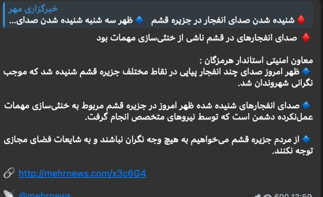

Shin ✓ @hey_itsmyturn
Tue, 19 May 2026 12:12:22 UTC

State-owned Mehr confirms the explosion(s), reports it was due to EOD

فارسی

خبرگزاری دولتی مهر وقوع انفجار(ها) را تایید و گزارش کرد که این حادثه ناشی از ای‌او‌دی (EOD - خنثی‌سازی مهمات انفجاری) بوده است.

𝕏 · @shin_persian

## ManotoTV — post 105640

  <a href="telegram/content/ManotoTV_105640_1779202196.mp4" target="_blank">🎬 Download video</a>

سازمان جهانی بهداشت شیوع ابولا در جمهوری دموکراتیک کنگو و اوگاندا را وضعیت اضطراری بهداشت عمومی با اهمیت بین‌المللی اعلام کرده است. تاکنون ده‌ها مورد مشکوک و چندین مورد مرگ ثبت شده و برخی مبتلایان از کنگو به اوگاندا سفر کرده‌اند.
سازمان جهانی بهداشت این وضعیت را به دلیل گسترش فرامرزی، افزایش سریع موارد، مرگ کادر درمان و ضعف زیرساخت‌های بهداشتی اضطراری اعلام کرده است.
در واکنش به شیوع، برخی کشورها از جمله آمریکا محدودیت‌های سفر اعمال کرده و تیم‌های بین‌المللی برای کنترل بیماری به منطقه اعزام شده‌اند.
مقامات تاکید کرده‌اند خطر برای عموم مردم خارج از مناطق درگیر پایین است، اما بیماری از طریق تماس مستقیم با مایعات بدن افراد مبتلا منتقل می‌شود و می‌تواند کشنده باشد. علائم بیماری شامل تب ناگهانی، خستگی شدید، درد عضلانی، اسهال، استفراغ و در موارد شدید خونریزی است.

## ManotoTV — post 105639

  <a href="telegram/content/ManotoTV_105639_1779202196.mp4" target="_blank">🎬 Download video</a>

به‌دنبال وزش باد شدید و خیزش گرد و خاک، کیفیت هوای تهران در شرایط ناسالم و قرمز قرار گرفت و به همه شهروندان توصیه شده از تردد غیرضروری در فضای باز خودداری کنند. اداره کل هواشناسی استان تهران نیز اعلام کرده است که طی ۲۴ ساعت آینده وزش باد و گرد و خاک در سطح استان ادامه خواهد داشت.

## ManotoTV — post 105638

  <a href="telegram/content/ManotoTV_105638_1779202196.mp4" target="_blank">🎬 Download video</a>

انفجاری در حاشیه شرقی دمشق و در نزدیکی مرکز مدیریت تسلیحات وابسته به وزارت دفاع سوریه در منطقه باب الشرقی رخ داد. این حادثه به‌گفته منابع محلی ناشی از انفجار یک خودروی بمب‌گذاری‌شده یا یک بمب کارگذاشته‌شده در خودرو بوده است. برخی گزارش‌ها نیز حاکی از آن است که نیروهای امنیتی خودرو را مشکوک تشخیص داده و در جریان اقدام برای کنترل آن، انفجار زودتر از موعد رخ داده یا یک بمب دیگر نیز در نزدیکی محل خنثی شده است. در این انفجار یک افسر نیروهای امنیت داخلی کشته و چهار نفر دیگر از نیروهای امنیتی و نظامی زخمی شدند. پس از حادثه، مسیرهای اطراف بسته شد، نیروهای امدادی و آمبولانس‌ها در محل حاضر شدند و نیروهای امنیتی منطقه را محاصره کرده و تحقیقات جنایی و فنی آغاز شد. این سومین یا چهارمین مورد از انفجارها و حملات مشابه در دمشق و حومه در طول ماه جاری است و تاکنون هیچ گروهی مسئولیت این حمله را بر عهده نگرفته است.

## ManotoTV — post 105637

  <a href="telegram/content/ManotoTV_105637_1779202197.mp4" target="_blank">🎬 Download video</a>

فرماندهی مرکزی ارتش آمریکا اعلام کرد نیروهای این کشور هم‌زمان با عبور ناو هواپیمابر آبراهام لینکلن از دریای عرب، ۸۸ کشتی تجاری را تغییر مسیر داده و چهار کشتی دیگر را برای «اطمینان از رعایت کامل» مقررات عملیاتی از کار انداخته‌اند.

بر اساس متن منتشرشده از سوی سنتکام، یک ملوان نیروی دریایی آمریکا روز دوشنبه ۲۸ اردیبهشت هنگام عبور ناو آبراهام لینکلن از دریای عرب، در حال دیده‌بانی روی عرشه این ناو دیده می‌شود.

## ManotoTV — post 105636

  <a href="telegram/content/ManotoTV_105636_1779202197.mp4" target="_blank">🎬 Download video</a>

استونی اعلام کرد یک جنگنده ناتو یک پهپاد مشکوک را در حریم هوایی این کشور سرنگون کرده است. این پهپاد از سمت روسیه وارد آسمان استونی شده بود و با یک موشک توسط یک جنگنده رومانیایی ناتو هدف قرار گرفت. همزمان لتونی هم هشدار هوایی صادر کرد و اعلام شد یک پهپاد وارد حریم هوایی این کشور شده و باعث شد در برخی مناطق مرزی قطارها و امتحانات مدارس متوقف و فروشگاه‌ها بسته شوند. استونی و لتونی روسیه را به اختلال در جی پی اس و جنگ الکترونیک متهم کرده و این رخدادها را مرتبط با جنگ اوکراین می‌دانند. ناتو تایید کرده که جنگنده عضو این پیمان این پهپاد را ساقط کرده و اعلام کرده تحقیقات درباره این حادثه ادامه دارد. هنوز مشخص نیست پهپادی که وارد لتونی و استونی شده یکی بوده یا چند پهپاد جدا و در روزهای اخیر چند کشور منطقه نیز موارد مشابه مشاهده کرده‌اند و این موضوع نگرانی‌ها درباره گسترش جنگ به کشورهای همسایه روسیه را افزایش داده است.

## ManotoTV — post 105635

  <a href="telegram/content/ManotoTV_105635_1779202198.mp4" target="_blank">🎬 Download video</a>

خبرگزاری رویترز گزارش داد پالایشگاه‌های دولتی چین از زمان آغاز جنگ ایران، تولید خود را بیش از یک میلیون بشکه در روز کاهش داده‌اند.
بر اساس این گزارش، اختلال در تامین نفت خاورمیانه و کاهش سودآوری پالایشگاه‌ها باعث شده شرکت‌های بزرگ نفتی چین از جمله سینوپک و پتروچاینا ظرفیت پالایش خود را کاهش دهند.
داده‌ها نشان می‌دهد میزان پالایش نفت خام در چین از حدود ۱۰ میلیون بشکه در روز پیش از حملات آمریکا و اسرائیل به ایران، به حدود ۸.۴ میلیون بشکه در ماه مه رسیده است.
رویترز همچنین گزارش داد افزایش قیمت نفت و کاهش تقاضا برای سوخت، حاشیه سود پالایشگاه‌های چینی را به‌شدت کاهش داده و همزمان محدودیت‌های دولت چین بر صادرات سوخت، باعث افزایش ذخایر داخلی بنزین و گازوئیل شده است.

## ManotoTV — post 105634

  <a href="telegram/content/ManotoTV_105634_1779202198.mp4" target="_blank">🎬 Download video</a>

ولی‌الله حیاتی، معاون امنیتی استانداری خوزستان، بعدازظهر سه‌شنبه ۲۹ اردیبهشت گفت سقوط یک «پرتابه» یا «شی ناشناس» در یک منطقه مسکونی اندیمشک چهار مصدوم بر جا گذاشت.

به گزارش ایرنا، این مقام محلی گفت این حادثه به یک باب مغازه و دو خودرو خسارت وارد کرده و بازتاب گسترده‌ای در شبکه‌های اجتماعی این شهرستان داشته است.

حیاتی در توضیح جداگانه‌ای درباره صداهای شنیده‌شده در آسمان اندیمشک گفت: «صدای شلیک‌های اخیر در آسمان اندیمشک به دلیل تست پدافند هوایی است، لذا مردم نگران نباشند.»

با این حال رسانه‌های داخلی و مقام‌های جمهوری اسلامی هنوز توضیحی درباره ماهیت «شی ناشناس» یا «پرتابه» سقوط‌کرده ارائه نکرده‌اند و مشخص نیست این حادثه ارتباطی با تست پدافند هوایی داشته است یا نه.

## ManotoTV — post 105633

  <a href="telegram/content/ManotoTV_105633_1779202199.mp4" target="_blank">🎬 Download video</a>

سخنگوی وزارت خارجه قطر اعلام کرد دوحه همچنان با واشنگتن و تهران در تماس است و این رایزنی‌ها ادامه خواهد داشت.
ماجد الانصاری، در واکنش به تصمیم دونالد ترامپ برای تعویق حمله برنامه‌ریزی‌شده به ایران به درخواست قطر، عربستان سعودی و امارات، گفت این اقدام «نشانه پاسخ مثبت» بوده است.
او همچنین با اشاره به مذاکرات میان آمریکا و جمهوری‌اسلامی گفت قطر از تلاش‌های دیپلماتیک پاکستان برای نزدیک کردن طرف‌ها و یافتن راه‌حل حمایت می‌کند و این روند «به زمان بیشتری نیاز دارد».
الانصاری درباره روابط دوحه و تهران گفت قطر همچنان روابط مثبتی با جمهوری‌اسلامی دارد، اما در عین حال افزود حمله جمهوری‌اسلامی به قطر «تهدیدی برای روابط دو کشور» به شمار می‌رود

## FarsiVOA — post 218142

  <a href="telegram/content/FarsiVOA_218142_1779202199.mp4" target="_blank">🎬 Download video</a>

ارتش اسرائیل اعلام کرد روز گذشته، ۲۸ اردیبهشت، یک انبار حاوی ده‌ها نوع تسلیحات و یک چاهک پرتاب موشک متعلق به سازمان تروریستی حماس را در شمال نوار غزه منهدم کرد.

سلاح‌های مخفی شده در این انبار شامل بیش از ۲۰ خمپاره، پرتابگر، مواد انفجاری، سلاح‌هایی از نوع کلاشنیکف و تجهیزات رزمی دیگر بود.

ارتش اسرائیل تاکید کرد نیروهایش در فرماندهی جنوب مطابق توافق در منطقه مستقر هستند و به فعالیت برای رفع هرگونه تهدید فوری ادامه می‌دهند.

## FarsiVOA — post 218141

🔺گروه هفت: تنگه هرمز باید باز شود

▪️کشورهای عضو گروه هفت بر ضرورت بازگشایی تنگه هرمز و مقابله با ناترازی‌های جاری در تجارت جهانی تأکید کردند.

⬇️ بیشتر بخوانید:

https://ir.voanews.com/a/iran-hormuz-g7-paris-finance-open/8151621.html/?nocach=1

## FarsiVOA — post 218140

🔺کاهش قیمت نفت پس از تعویق ازسرگیری عملیات نظامی علیه جمهوری اسلامی

▪️پس از آن‌که دونالد ترامپ، رئیس جمهوری آمریکا، اعلام کرد برای فراهم شدن فرصت مذاکرات جهت پایان دادن به جنگ در خاورمیانه، حمله برنامه‌ریزی‌شده به رژیم ایران را متوقف کرده است، قیمت نفت روز سه‌شنبه ۲۹ اردیبهشت کاهش یافت، و نفت خام برنت، شاخص جهانی بازار، ۱.۵ درصد افت قیمت پیدا کرد.

⬇️ بیشتر بخوانید:

https://ir.voanews.com/a/reuters-oil-price-fell-after-trump-paused-iran-attack/8151615.html/?nocach=1

## FarsiVOA — post 218139

🔺تغییر مسیر ۸۸ شناور و از کار انداختن ۴ کشتی توسط سنتکام در جریان محاصره دریایی جمهوری اسلامی

▪️سنتکام در یک به‌روز‌رسانی تازه درباره محاصره دریایی جمهوری اسلامی، شمار شناورهایی را که در جریان این عملیات وادار به تغییر مسیر شده و یا از کار افتاده‌اند، اعلام کرد.

⬇️ بیشتر بخوانید:

https://ir.voanews.com/a/centcom-ship-iran-redirect/8151611.html/?nocach=1

## FarsiVOA — post 218138

  <a href="telegram/content/FarsiVOA_218138_1779202201.mp4" target="_blank">🎬 Download video</a>

ارتش اسرائیل در شبانه‌روز گذشته بیش از ۲۵ بار مواضع متعلق به حزب‌الله را در جنوب لبنان هدف قرار داد و اعلام کرد این اهداف شامل انبارهای تسلیحات، مراکز فرماندهی و دیگر زیرساخت‌هایی بود که «این گروه از آن‌ها برای پیشبرد طرح‌های تروریستی علیه نیروهای ارتش اسرائیل و کشور اسرائیل استفاده می‌کردند.»

ارتش اسرائیل همچنین اعلام کرد «در منطقه رشته‌کوه کریستوفنی در جنوب لبنان تروریست‌ها را هدف قرار داد و پرتابگرهایی را که پیش‌تر به سوی نیروهای ارتش اسرائیل و خاک این کشور شلیک کرده بودند، منهدم کرد.»

## FarsiVOA — post 218137

🔺تداوم حملات ارتش اسرائیل به زیرساخت‌های حزب‌الله در جنوب لبنان

▪️اسرائیل از انجام حملات متعدد به مواضع و تاسیسات حزب‌الله لبنان خبر داد.

⬇️ بیشتر بخوانید:

https://ir.voanews.com/a/israeli-army-terrorist-attack-hezbollah/8151604.html/?nocach=1

## FarsiVOA — post 218136

  <a href="telegram/content/FarsiVOA_218136_1779202202.mp4" target="_blank">🎬 Download video</a>

لحظه زیر گرفتن عابران توسط یک خودرو در ایتالیا؛ رد تروریستی بودن حادثه از سوی مقامات امنیتی؛

مقامات ایتالیا رسماً اعلام کردند که حمله روز گذشته با خودرو به عابران پیاده در شهر مودنا، یک اقدام تروریستی نبوده است.

این حمله توسط فردی به نام «سلیم الکودری» انجام شده بود.

بر اساس گزارش خبرگزاری‌های رسمی از جمله رویترز، این حادثه هیچ کشته‌ای نداشته، اما ۸ نفر زخمی شده‌اند که حال ۴ نفر از آن‌ها وخیم گزارش شده است.

بر اساس بیانیه دستگاه‌های امنیتی و قضایی ایتالیا، بررسی‌ها نشان می‌دهد این اقدام ناشی از «مشکلات روحی و روانی» شدید ضارب بوده و هیچ انگیزه تروریستی یا سازمان‌یافته‌ای پشت آن نبوده است.
@FarsiVOA

## FarsiVOA — post 218135

  

خبرگزاری میزان، وابسته به قوه قضائیه جمهوری اسلامی، گزارش داد با دستور مقام قضایی، اموال ۵۲ نفر در استان زنجان به اتهام ارتباط با شبکه‌های «همکار با دشمن» توقیف شده است.

علی فرجی، رئیس کل دادگستری زنجان، گفت این اموال شامل وجوه بانکی و ارزی، اموال منقول و غیرمنقول و طلاست و قرار است برای بازسازی اماکن آسیب‌دیده از جنگ هزینه شود. به گفته او، هفت نفر از متهمان در بازداشت هستند و تعدادی دیگر خارج از کشور به سر می‌برند.

این اقدام در ادامه موج گسترده‌تری از پرونده‌سازی‌های قضایی پس از جنگ انجام می‌شود. سخنگوی قوه قضائیه پیش‌تر گفته بود بر اساس قانون تشدید مجازات جاسوسی و همکاری با اسرائیل و دولت‌های متخاصم، همکاری اطلاعاتی می‌تواند با توقیف اموال و حتی اعدام همراه باشد.

در هفته‌های گذشته نیز قوه قضائیه از صدور دستور توقیف اموال ده‌ها نفر، از جمله کارکنان رسانه‌های فارسی‌زبان خارج از کشور، خبر داده بود.
@FarsiVOA

## FarsiVOA — post 218134

🔺قطر: جمهوری اسلامی حق ندارد مانع عبور کشتی‌ها از تنگه هرمز شود

▪️ماجد انصاری، سخنگوی وزارت خارجه قطر با تأکید بر حق عبور امن از تنگه هرمز اعلام کرد که هیچ کشوری، از جمله حکومت ایران، حق ندارد مانع عبور یا موجب بسته شدن این تنگه برای کشتیرانی دریایی شود.

▪️انصاری روز سه‌شنبه در یک نشست خبری در دوحه گفت: «بر اساس قواعد حقوق بین‌الملل، عبور امن از تنگه هرمز حق دولت قطر است.»

▪️در حالی که مقامات جمهوری اسلامی از ایجاد سازوکاری برای کنترل تنگه هرمز از سوی حکومت ایران خبر داده‌اند، این مقام قطری گفت: «هیچ تغییری در وضعیت موجود مربوط به آزادی کشتیرانی در تنگه هرمز قابل پذیرش نیست.»

⬇️ بیشتر بخوانید:
https://ir.voanews.com/a/8151599.html

## FarsiVOA — post 218133

  

عضو انجمن شرکت‌های حمل‌ونقل بین‌المللی ایران با بیان اینکه ایستایی کامیون‌ها در مرز بازرگان به ۲۰ روز رسیده است، هزینه این توقف را ماهانه ۱۰ میلیون دلار برآورد کرد.

احسان ملک‌زاده، در گفت‌وگو با خبرگزاری مهر اعلام کرد که هم‌اکنون حدود سه هزار کامیون در صف خروج مرز بازرگان قرار دارند. وی افزود که در سایر مرزها نیز کامیون‌ها بین ‍پنج تا ۱۰ روز در انتظار خروج از کشور می‌مانند.

او مهم‌ترین عامل توقف کامیون‌ها در مرز بازرگان را «ظرفیت محدود پذیرش از طرف ترکیه» اعلام کرد و مدعی شد این کشور «تنها حدود ۲۵۰ کامیون از ایران» در روز پذیرش می‌کند.

جمهوری اسلامی پس از آنکه به دلیل اخلال در تنگه هرمز، با محاصره دریایی از سوی ایالات متحده آمریکا روبه‌رو شد، ناچار از توسل به حمل و نقل جاده‌ای شد.

روز دوشنبه ۲۸ اردیبهشت، فرماندهی مرکزی ایالات متحده، سنتکام، اعلام کرد که اجرای محاصره دریایی آمریکا علیه بنادر ایران همچنان ادامه دارد. این محاصره دست‌کم تا زمان رفع اختلال در تردد کشتی‌ها از سوی جمهوری اسلامی ادامه خواهد داشت.
@FarsiVOA

## FarsiVOA — post 218132

  

رویترز به نقل از وب‌سایت خبری دلفی گزارش داد یک جنگنده ناتو روز سه‌شنبه یک پهپاد با منشأ احتمالی اوکراینی را در حریم هوایی استونی سرنگون کرده است.

هانو پِوکور، وزیر دفاع استونی، به دلفی گفت این پهپاد در حریم هوایی استونی شناسایی و هدف قرار گرفت. ناتو تا زمان انتشار گزارش رویترز به درخواست این خبرگزاری برای اظهارنظر پاسخ نداده بود.

این رخداد تازه‌ترین مورد از مجموعه نقض‌های حریم هوایی در منطقه بالتیک و مرزهای شرقی ناتو در نزدیکی روسیه است. به نوشته رویترز، این حادثه در ادامه مجموعه‌ای از ورود پهپادهای اوکراینی یا مشکوک به اوکراینی به حریم هوایی کشورهای عضو ناتو رخ داده است؛ بحرانی که در لتونی ابتدا به استعفای وزیر دفاع و سپس به استعفای نخست‌وزیر و فروپاشی دولت ائتلافی انجامید.

این حادثه در حالی رخ داده که حملات پهپادی روسیه و اوکراین در هفته‌های اخیر شدت گرفته و خطر ورود پهپادهای سرگردان یا منحرف‌شده به حریم هوایی کشورهای عضو ناتو را افزایش داده است.
@FarsiVOA

## DW_Farsi — post 124874

📸 مراسم ازدواج "زوج‌های جان‌فدا"؛ کارناوال عروس‌ودامادها با خودروهای جنگی در تهران

در حالی‌که ایران در وضعیت آتش‌بسی شکننده به سر می‌برد و سایه جنگ، ناامنی، بحران اقتصادی و بیکاری بر زندگی مردم سنگینی می‌کند، جمهوری اسلامی همچنان می‌کوشد تصویری عادی و حتی پرشور از وضعیت کشور ارائه دهد که فاصله‌ای آشکار با واقعیت روزمره بسیاری از شهروندان دارد.

سپاه پاسداران از برگزاری مراسم حکومتی موسوم به "پیوند آسمانی زوج‌های جان‌فدا" خبر داده که در آن عروس و دامادها با جیپ‌ها و خودروهای نظامی گل‌آرایی‌شده در خیابان‌های تهران به حرکت درآمدند.
@dw_farsi

## DW_Farsi — post 124873

  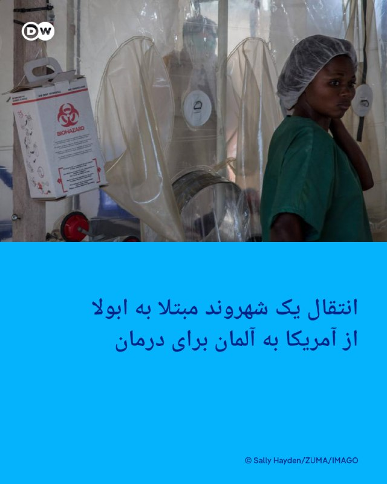

🔶 انتقال یک شهروند مبتلا به ابولا از آمریکا به آلمان برای درمان

یک شهروند آمریکایی مبتلا به ویروس ابولا قرار است جهت مداوا به آلمان منتقل شود. وزارت بهداشت فدرال آلمان این خبر را تأیید و اعلام کرد که مقامات ایالات متحده برای درمان این شهروند که در جمهوری دموکراتیک کنگو به این ویروس مبتلا شده درخواست کمک کرده‌اند.

در حال حاضر تدابیر لازم در این زمینه در حال اتخاذ است، اما وزارت بهداشت آلمان جزئیات بیشتری ارائه نکرده است.

به گفته مقامات، تنها در مناطق درگیر در کنگو، ۵۱۳ مورد مشکوک به ابتلا به ابولا و ۱۳۱ مورد فوتی ثبت شده است.

سازمان بهداشت اتحادیه آفریقا یا همان "مرکز کنترل و پیشگیری از بیماری‌های آفریقا" به دلیل شیوع ابولا در کنگو و اوگاندا، در سراسر این قاره اعلام وضعیت اضطراری کرده است.

خطر شیوع این بیماری به دلیل ترددهای مرزی و جابه‌جایی‌های زیاد مرتبط با بخش معدن بسیار بالا ارزیابی شده است.

سازمان جهانی بهداشت کمیته اضطراری خود را فراخوانده تا با تشکیل جلسه‌ای در بعدازظهر امروز ۱۹ مه با حضور کارشناسان توصیه‌هایی را برای چگونگی مقابله با این طغیان بیماری تدوین کند.

تدروس آدهانوم قبریسوس، مدیرکل سازمان جهانی بهداشت در ژنو ابراز نگرانی عمیق خود را نسبت به ابعاد و سرعت انتشار این اپیدمی اعلام کرد.

سازمان جهانی بهداشت در آخر هفته گذشته به دلیل شیوع ابولا وضعیت اضطراری بین‌المللی اعلام کرده بود.

@dw_farsi

## DW_Farsi — post 124872

  

🔶 الاخبار: عربستان از عملکرد آمریکا ناخشنود است

نشریه لبنانی "الاخبار" به نقل از منابع مصری گزارش داد، عربستان سعودی در روزهای اخیر رایزنی‌های فشرده‌ای با طرف‌های عربی و کشورهای حاشیه خلیج فارس داشته است تا به موضعی هماهنگ در مورد چگونگی تعامل با جمهوری اسلامی در وضعیت کنونی و همچنین پس از جنگ دست یابد.

این منابع با استناد به اظهارات دیپلمات‌های سعودی گفته‌اند، ریاض از "سیاست‌های غافلگیرکننده" واشنگتن ناراضی و به دولت ایالات متحده اعتماد لازم را ندارد.

گزارش الاخبار در حالی منتشر می‌شود که دونالد ترامپ، رئیس جمهور آمریکا عصر دوشنبه ۱۸ مه (۲۸ اردیبهشت) با انتشار پستی در شبکه اجتماعی خود، تروث سوشال اعلام کرد، ایالات متحده حمله نظامی "برنامه‌ریزی‌شده" علیه ایران را که قرار بود روز سه‌شنبه انجام شود، "اجرا نخواهد کرد".

ترامپ در پست خود مدعی شد که "امیر قطر، تمیم بن حمد آل ثانی، ولیعهد عربستان محمد بن سلمان آل سعود و رئیس امارات محمد بن زاید آل نهیان" از او خواسته‌اند تا این حمله را به تعویق بیاندازد، زیرا "مذاکرات جدی هم‌اکنون در جریان است و به نظر آن‌ها، به‌عنوان رهبران و متحدان بزرگ، توافقی حاصل خواهد شد که برای ایالات متحده آمریکا، همه کشورهای خاورمیانه و فراتر از آن بسیار قابل قبول خواهد بود".

@dw_farsi

## DW_Farsi — post 124871

  

🔶 نتایج یک نظرسنجی: جنگ با ایران محبوبیت ترامپ را کاهش داده است

طبق یک نظرسنجی جدید، محبوبیت دونالد ترامپ، رئیس‌جمهور آمریکا در میان شهروندان این کشور به دلیل پیامدهای جنگ با جمهوری اسلامی ایران به‌شدت دچار افت شده است.

روزنامه ایندیپندنت نیز با اشاره به نظرسنجی مشترکی که نیویورک‌ تایمز و کالج سینا (Siena College) در اواسط ماه مه در میان ۱۵۰۰ نفر انجام دادند نوشت، تنها ۳۷درصد از رأی‌دهندگان عملکرد ترامپ را به عنوان یک رئیس جمهور تأیید کرده‌اند. در مقابل، تقریبا ۵۹درصد اعلام کردند که موافق عملکرد او نیستند.

ترامپ در زمینه مدیریت جنگ ایران نیز نمرات پایینی از سوی رأی‌دهندگان دریافت کرد؛ به طوری که ۶۵درصد با عملکرد او در این مورد مخالف بودند و بیش از نیمی از شرکت‌کنندگان معتقد بودند که او با ایجاد جرقه درگیری با ایران در ماه فوریه، تصمیم اشتباهی گرفته است.

اما بیشترین میزان نارضایتی رأی‌دهندگان (اعم از جمهوری‌خواه و دموکرات) از رئیس‌جمهور، مربوط به نحوه مدیریت هزینه‌های زندگی در ایالات متحده است.

تقریبا ۶۹درصد از رأی‌دهندگان اعلام کردند که با عملکرد ترامپ در این زمینه مخالف هستند که در این میان، یک‌سوم از مخالفان را خود جمهوری‌خواهان تشکیل می‌دهند.

با وجود اینکه او با وعده کاهش هزینه‌های روزمره مردم آمریکا (از پمپ بنزین گرفته تا قفسه فروشگاه‌های مواد غذایی) کمپین انتخاباتی خود را پیش برد، تورم در طول سال گذشته به‌طور پیوسته افزایش یافته است؛ به‌ویژه در بخش انرژی.

افزایش هزینه‌های انرژی با جنگ ایران نیز مرتبط دانسته شده؛ نبردی که در پی تنش‌ها در تنگه هرمز قیمت‌های جهانی نفت را دچار اختلال و نوسان کرده است.

اکثر رأی‌دهندگان خواهان ازسرگیری جنگ ایالات متحده با ایران نیستند، حتی اگر مذاکره‌کنندگان آمریکایی نتوانند به زودی با ایران برای پایان دادن به برنامه غنی‌سازی هسته‌ای این کشور به توافق برسند.

به گزارش ایندیپندنت، جمهوری‌خواهان همچنان تا حد زیادی از سیاست‌های ترامپ حمایت می‌کنند؛ به‌طوری که ۸۲درصد اعلام کرده‌اند که عملکرد او را، به‌ویژه در موضوع مهاجرت، تأیید می‌کنند. اکثر آن‌ها هنوز از جنگ با ایران حمایت می‌کنند، هرچند تقریباً یک‌چهارم آن‌ها مطمئن نیستند که آیا این جنگ تصمیم درستی بوده است یا خیر.

با این حال، محبوبیت رئیس‌جمهور در میان رأی‌دهندگان حزب خود نیز در زمینه اقتصاد و هزینه‌های زندگی به‌طور قابل‌توجهی کاهش یافته است.

@dw_farsi

## DW_Farsi — post 124870

  

🔶 بازداشت ۱۱۰ نفر در ترکیه به ظن ارتباط با داعش

مقامات امنیتی و ضدترور ترکیه سه‌شنبه ۱۹ مه (۲۹ اردیبهشت) از بازداشت ۱۱۰ نفر به اتهام ارتباط و وابستگی به سازمان تروریستی داعش خبر دادند. عملیات نیروهای امنیتی با برنامه‌ریزی و سازماندهی دادستانی کل ترکیه انجام گرفت.

به گزارش خبرگزاری آنادولو بازداشت‌شدگان متهم هستند که در انجمن‌های غیرقانونی و کلاس‌های درس، کودکان را طبق ایدئولوژی‌های داعش آموزش می‌دادند تا نیروهای جدید جذب کرده و همچنین برای داعش کمک‌های مالی جمع‌آوری کنند.

عملیات نیروهای امنیتی در سه استان صورت گرفته که بخش اعظم آن بر استانبول متمرکز بوده است. افزون بر بازداشت ۱۱۰ نفر، ۴ قبضه سلاح، ۹۰ فشنگ و اسناد و داده‌های دیجیتال کشف و ضبط شده است.

وزارت کشور ترکیه اعلام کرد که پلیس این کشور در هفته گذشته در جریان بازرسی‌ها و عملیات تفتیش در ۴۷ نقطه مختلف کشور ۳۴۲ نفر را به اتهام عضویت در سازمان تروریستی داعش بازداشت کرده است.

@dw_farsi

## DW_Farsi — post 124869

  

🔶 ارتش اسرائیل از کشته شدن یک عضو حماس خبر داد
 
سخنگوی ارتش اسرائیل سه‌شنبه ۱۹ مه (۲۹ اردیبهشت) اعلام کرد نیروهای تیپ ۱۸۸ در جنوب نوار غزه، "یکی از اعضای سازمان تروریستی حماس را که به مواضع نظامیان اسرائیلی نزدیک شده و تهدیدی فوری محسوب می‌شده، هدف قرار دادند".
 
ارتش اسرائیل اعلام کرد که این فرد، "در حملات ۷ اکتبر وارد خاک اسرائیل شده بود و در روزهای اخیر نیز قصد اجرای عملیات تروریستی علیه نیروهای اسرائیلی را داشت".
 
ارتش اسرائیل در پیام خود در شبکه ایکس (توئیتر سابق) نوشت، این فرد که از "خط زرد" عبور کرده بود، شناسایی شد و نیروی هوایی اسرائیل با هماهنگی نیروهای زمینی او را از "حذف کرد".
 
به نوشته تایمز اسرائیل، ارتش این کشور جزییاتی در مورد هویت و نام این عضو حماس ذکر نکرده است.
@dw_farsi

## Persian_Trend_Official — post 14481

برای طراحی چند صفحه از وبسایت پرشین ترند به یک وردپرس‌کار حرفه‌ای، خوش‌سلیقه و سریع نیاز داریم. کار در فاز اول خیلی بزرگ و پیچیده نیست؛ فقط طراحی و آماده‌سازی ۲ تا ۳ صفحه اصلی مورد نیاز است: صفحه تماشای لایو و ویدیو صفحه آرشیو لایوهای قبلی صفحه معرفی جایگاه‌های…

## Persian_Trend_Official — post 14480

  <a href="telegram/content/Persian_Trend_Official_14480_1779202208.webm" target="_blank">🎬 Download video</a>

برای طراحی چند صفحه از وبسایت پرشین ترند به یک وردپرس‌کار حرفه‌ای، خوش‌سلیقه و سریع نیاز داریم.
کار در فاز اول خیلی بزرگ و پیچیده نیست؛ فقط طراحی و آماده‌سازی ۲ تا ۳ صفحه اصلی مورد نیاز است:
صفحه تماشای لایو و ویدیو
صفحه آرشیو لایوهای قبلی
صفحه معرفی جایگاه‌های تبلیغاتی و همکاری با اسپانسرها
نیاز ما بیشتر روی ظاهر حرفه‌ای، طراحی تمیز، ریسپانسیو بودن برای موبایل و دسکتاپ، سرعت اجرا و سلیقه بصری خوب است.
ترجیحاً کسی پیام بدهد که:
تجربه طراحی سایت وردپرسی حرفه‌ای داشته باشد
با طراحی صفحات رسانه‌ای، ویدیویی یا خبری آشنا باشد
بتواند کار را سریع، حدوداً در یکی دو روز، جمع کند
خوش‌قول، دقیق و قابل‌اعتماد باشد
نمونه‌کار واقعی برای ارائه داشته باشد
بتواند بدون قالب‌های شلوغ و سنگین، یک خروجی تمیز و سبک تحویل دهد
این پروژه فعلاً فاز اول است و اگر همکاری خوب باشد، برای توسعه‌های بعدی سایت هم ادامه خواهد داشت.
افرادی که تجربه و زمان کافی دارند، لطفاً نمونه‌کار، توضیح کوتاه از توانایی‌ها و حدود هزینه پیشنهادی‌شان را ارسال کنند.
📩 برای هماهنگی پیام بدهید.

@NickTARTARUS
‌

## Persian_Trend_Official — post 14479

  

شاید در دنیای موازی 🤷‍♂️

📝 Nick

📌 @persian_trend_official
پرشین ترند | متفاوت‌ترین کانال نظامی

## Persian_Trend_Official — post 14478

  <a href="telegram/content/Persian_Trend_Official_14478_1779202209.webm" target="_blank">🎬 Download video</a>

کسی می‌دونه سردار سلامی کجاست؟؟؟

📝 Nick

📌 @persian_trend_official
پرشین ترند | متفاوت‌ترین کانال نظامی

## Persian_Trend_Official — post 14477

💢 این انفجار در نزدیکی یکی از ساختمانهای وابسته به وزارت دفاع دولت «الجولانی» رخ داده است ▪️ منابع محلی گفتند پس از انفجار، صدای تیراندازی همچنان به گوش می‌رسد. 🫆:Tony 📌 @persian_trend_official پرشین ترند | متفاوت‌ترین کانال نظامی

## Persian_Trend_Official — post 14476

  <a href="telegram/content/Persian_Trend_Official_14476_1779202209.webm" target="_blank">🎬 Download video</a>

⭕️تعلیق پروازهای بریتیش ایرویز به اسرائیل

💢خطوط هوایی «بریتیش ایرویز» از لغو پروازها به اسرائیل تا یک اوت خبر داد.

🫆:Tony

📌 @persian_trend_official
پرشین ترند | متفاوت‌ترین کانال نظامی

## Persian_Trend_Official — post 14474

💢زلزله ۴.۶ ریشتری در نورآباد لرستان

💢زمین لرزه ۴.۶ ریشتری در عمق ۸ کیلومتری زمین نورآباد لرستان را لرزاند.

🫆:Tony

📌 @persian_trend_official
پرشین ترند | متفاوت‌ترین کانال نظامی

## Persian_Trend_Official — post 14473

  

💢برای ۸۱ روز، جمهوری اسلامی اینترنت را در ایران خاموش کرده تا صدای مردم را خفه کند.

▪️جمهوری اسلامی بار دیگر ثابت کرد که از هیچ جنایتی برای حفظ قدرت خود دریغ نمیکند.

🫆:Tony

📌 @persian_trend_official
پرشین ترند | متفاوت‌ترین کانال نظامی

## Persian_Trend_Official — post 14472

  

🔴 گزارش‌ها از وقوع انفجار در دمشق 💢خبرنگار الحدث از وقوع یک انفجار با منشأ نامشخص در نزدیکی منطقه «باب شرقی» دمشق خبر داد. ▪️فارس مدعی شد انفجار ناشی از خودرو بمب گذاری شده بوده است. 🫆:Tony 📌 @persian_trend_official پرشین ترند | متفاوت‌ترین کانال نظامی

## Persian_Trend_Official — post 14471

  <a href="telegram/content/Persian_Trend_Official_14471_1779202210.webm" target="_blank">🎬 Download video</a>

🔴 گزارش‌ها از وقوع انفجار در دمشق

💢خبرنگار الحدث از وقوع یک انفجار با منشأ نامشخص در نزدیکی منطقه «باب شرقی» دمشق خبر داد.

▪️فارس مدعی شد انفجار ناشی از خودرو بمب گذاری شده بوده است.

🫆:Tony

📌 @persian_trend_official
پرشین ترند | متفاوت‌ترین کانال نظامی

## Persian_Trend_Official — post 14470

  <a href="telegram/content/Persian_Trend_Official_14470_1779202211.webm" target="_blank">🎬 Download video</a>

💢شنیده شدن صدای انفجار در جزیره قشم ▪️ظهر سه شنبه شنیده شدن صدای انفجار در جزیره قشم از سوی ساکنان محلی گزارش شده است. 🔹اخبار تکمیلی متعاقباً منتشر خواهد شد./خبرگزاری مهر 🫆:Tony 📌 @persian_trend_official پرشین ترند | متفاوت‌ترین کانال نظامی

## RadioFarda — post 157351

آمریکا خواستار شدت عمل بیشتر کشورهای اروپایی و آسیایی علیه شبکه‌های مالی ایران شد

🔸اسکات بسنت، وزیر خزانه‌داری آمریکا، روز سه‌شنبه ۲۹ اردیبهشت از متحدان واشینگتن در اروپا و آسیا خواست با شدت بیشتری شبکه‌های مالی ایران را مختل کنند و گفت وزارتخانه او فهرست تحریم‌های خود را از موارد قدیمی و منسوخ پاکسازی خواهد کرد.

🔸به گزارش خبرگزاری رویترز، بسنت در سخنرانی آماده‌شده‌ای برای کنفرانس مقابله با تأمین مالی تروریسم، که پس از نشست وزیران دارایی گروه هفت در پاریس برگزار شد، گفت شرکت‌کنندگان باید «به‌طور کامل در کنار ما» علیه ایران بایستند.

🔸او گفت: «این امر، برای مثال، مستلزم آن است که شرکای اروپایی ما با ایالات متحده در اقدام علیه ایران همراه شوند؛ از طریق تحریم تأمین‌کنندگان مالی آن، افشای شرکت‌های پوششی و صوری، تعطیل کردن شعب بانکی و برچیدن شبکه‌های نیابتی آن.»

🔸او افزود: «همچنین لازم است کشورهای خاورمیانه و آسیا شبکه‌های بانکداری سایه ایران را ریشه‌کن کنند.»

🔸در حالی که دولت ترامپ تلاش می‌کند تهران را برای بازگشایی تنگه هرمز که از زمان آغاز جنگ اخیر آمریکا و اسرائیل با ایران مسدود شده تحت فشار قرار دهد، وزارت خزانه‌داری آمریکا تلاش‌های تحریمی خود علیه ایران را از طریق برنامه‌ای با عنوان «خشم اقتصادی» تشدید کرده است.

🔸این برنامه با هدف مختل کردن شبکه‌های بانکداری سایه ایران اجرا می‌شود و تاکنون نزدیک به نیم میلیارد دلار ارز دیجیتال مرتبط با حکومت ایران را مسدود کرده است..

🔸 گزارش کامل را در وب‌سایت رادیوفردا بخوانید.

@RadioFarda

## RadioFarda — post 157350

🔸وزیران دارایی هفت کشور صنعتی جهان بعد از دو روز گفت‌وگو در پاریس، در بیانیه‌ای که روز سه‌شنبه منتشر شد با اشاره به چالش‌های متعدد اقتصاد دنیا، خواستار «بازگشت سریع به عبور و مرور آزاد و امن» کشتی‌ها از تنگه هرمز شدند. 🔸اسکات بسنت، وزیر خزانه‌داری آمریکا،…

## RadioFarda — post 157349

  

🔸وزیران دارایی هفت کشور صنعتی جهان بعد از دو روز گفت‌وگو در پاریس، در بیانیه‌ای که روز سه‌شنبه منتشر شد با اشاره به چالش‌های متعدد اقتصاد دنیا، خواستار «بازگشت سریع به عبور و مرور آزاد و امن» کشتی‌ها از تنگه هرمز شدند.

🔸اسکات بسنت، وزیر خزانه‌داری آمریکا، نیز در شبکه ایکس نوشت که در این نشست، «گفت‌وگوهای سازنده‌ای» درباره ایران، مواد معدنی حیاتی، امنیت سایبری و عدم توازن‌های جهانی داشته است.

🔸بعد از صدور بیانیه پایانی، وزیر دارایی فرانسه اذعان کرد که دو روز گفت‌وگو میان وزرای گروه هفت «گاهی دشوار» بوده است، هرچند این گروه در نهایت بر سر بیانیه‌ای برای تعهد به همکاری چندجانبه در مقابله با خطرات فزاینده اقتصادی به توافق رسید.

🔸بیانیه پایانی وزیران گروه هفت «تعهد ما به همکاری چندجانبه برای مقابله با خطرات پیش روی اقتصاد جهانی» را تأیید کرد.

🔸در پس‌زمینه جنگ آمریکا و اسرائیل با ایران، در این بیانیه آمده است که «چالش‌های جهانی متعدد و پیچیده‌ای وجود دارد که نیازمند پاسخ‌های هماهنگ هستند.»

@RadioFarda

## RadioFarda — post 157348

  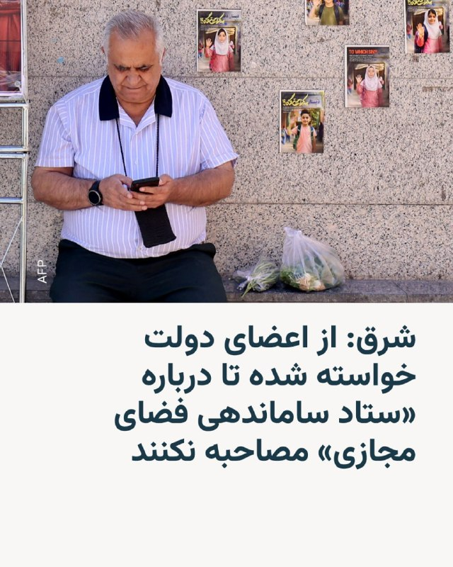

🔸روزنامه شرق در گزارشی درباره ستاد تازه‌تشکیل‌شدهٔ «ساماندهی فضای مجازی» به ریاست معاون اول رئیس‌جمهور ایران، نوشت که از برخی اعضای دولت «خواسته شده» تا درباره جزئیات و مأموریت‌های این ساختار با رسانه‌ها مصاحبه نکنند.

🔸در این گزارش که روز سه‌شنبه ۲۹ اردیبهشت و با عنوان «حکمرانی دیجیتال در سایه ابهام» منتشر شده، آمده است: ستادی که قرار است به گفته رئیس‌جمهور، به «چندصدایی» و «موازی‌کاری» در حکمرانی اینترنت پایان دهد، «خود به یکی از مبهم‌ترین و پرحاشیه‌ترین ساختارهای سیاست‌گذاری دیجیتال کشور تبدیل شده است».

🔸شرق نوشته که «دستور» محمدرضا عارف به خودداری اعضای دولت از صحبت با رسانه‌ها درباره این ستاد، در حالی است که با تشکیل این ستاد، «شائبه‌ها درباره شکل‌گیری یک مرکز تازه قدرت در سیاست اینترنت ایران، پررنگ‌تر» و «آشفتگی در حکمرانی فضای مجازی» ایران، نمایان‌تر شده است.

🔸این روزنامه به نقل از کارشناسان و منتقدان تأکید کرده که در شرایطی که خود رئیس‌جمهور ریاست شورای عالی فضای مجازی و شورای عالی امنیت ملی را نیز برعهده دارد، «به راحتی می‌تواند گره کوری که در اینترنت ایجاد شده است را باز کند».

@Radiofarda

## RadioFarda — post 157347

  <a href="https://t.me/radiofarda/157347" target="_blank">📎 Download file</a>

📻بشنوید: ساعت ۱۴ با رادیوفردا، ۲۹ اردیبهشت ۱۴۰۵‌

@Radiofarda

## RadioFarda — post 157346

  

🔸ایووت کوپر، وزیر خارجه بریتانیا روز سه‌شنبه ۲۹ اردیبهشت هشدار داد که جهان دیگر نمی‌تواند بیش از این برای بازگشایی تنگه هرمز صبر کند و ادامه بسته‌ماندن آن امنیت غذایی کشورهای آسیب‌پذیر را با بحران جدی‌تری روبه‌رو می‌کند.

🔸وزارت خارجه بریتانیا روز سه‌شنبه اعلام کرد کوپر در کنفرانس جهانی مشارکت‌ها در لندن، با اشاره به پیامدهای بحران جنگ ایران بر انرژی، کود کشاورزی و قیمت مواد غذایی، خواستار فشار فوری بین‌المللی برای بازگشایی تنگه هرمز شده است.

🔸ایووت کوپر در کنفرانس جهانی مشارکت‌ها در لندن هشدار داد که جهان در آستانه یک بحران غذایی جهانی قرار دارد و نمی‌توان اجازه داد ده‌ها میلیون نفر به‌دلیل بسته‌ماندن یک مسیر بین‌المللی کشتیرانی که ایران آن را «گروگان» گرفته با گرسنگی روبه‌رو شوند.

🔸کوپر تأکید کرد چالش‌های جهانی، مانند بحران ایران، در مرزها متوقف نمی‌شوند و راه‌حل‌های آنها نیز متوقف نمی‌شوند و نیازمند همکاری بین‌المللی است.

@RadioFarda

## IranianMinds — post 20395

  <a href="telegram/content/IranianMinds_20395_1779202213.mp4" target="_blank">🎬 Download video</a>

🔴 ترامپ درباره ایران:

دیروز یک تماس گرفتم و گفتن آقا، می‌تونید صبر کنید؟ فکر می‌کنیم به یک توافق نزدیکیم.

منم گفتم اشکالی نداره.

@IranianMinds

## IranianMinds — post 20394

🔴 ترامپ :

داریم با ایرانیا همین الان مذاکره میکنیم.

@IranianMinds

## IranianMinds — post 20393

  <a href="telegram/content/IranianMinds_20393_1779202214.mp4" target="_blank">🎬 Download video</a>

🔴 ترامپ :

فقط یک‌ ساعت تا حمله به ایران فاصله داشتیم.

@IranianMinds

## IranianMinds — post 20392

🔴 ترامپ :

ایران میخواد خاورمیانه رو نابود کنه ولی ما اجازه اینکارو بهش نمیدیم !

@IranianMinds

## IranianMinds — post 20391

🔴 ترامپ:

ممکن است مجبور شویم یک حمله دیگر به ایران انجام دهیم، اما مطمئن نیستم.

@IranianMinds

## IranianMinds — post 20390

  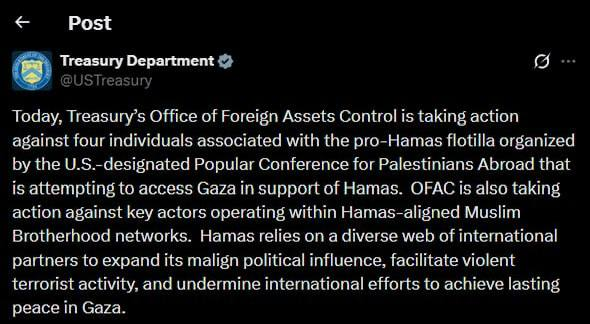

🔴 وزارت خزانه‌داری آمریکا سازندگان ناوگان‌های حامی فلسطین را تحریم کرد.

@IranianMinds

## IranianMinds — post 20389

🔴والا نیوز:

در صورت تصمیم ترامپ برای حمله مجدد به ایران، هماهنگی‌هایی با چند کشور خاورمیانه انجام شده است.

@IranianMinds

## IranianMinds — post 20388

  

🔴 دو سال پیش در چنین روزی ابراهیم رئیسی رو خرس خورد.

@IranianMinds

## IranianMinds — post 20387

🔴 سازمان عفو بین‌الملل اعلام کرد تعداد اعدام‌ها در جهان طی سال 2025 به بالاترین سطح در 44 سال گذشته رسیده.

طبق این گزارش، جمهوری اسلامی اصلی‌ترین عامل افزایش آمار اعدام‌ها در جهان بوده.

@IranianMinds

## IranianMinds — post 20386

🔴 وال استریت ژورنال : ترامپ گفت حمله برنامه‌ریزی‌شده به ایران را متوقف کرده چون رهبران کشورهای خلیج فارس خواستند زمان بیشتری برای مذاکرات بدهند تا شاید به توافق برسند. او دستور داده ارتش آماده باشد ولی فعلاً حمله انجام نشود. چند مقام خلیج فارس بعد این…

## IranianMinds — post 20385

🔴خبرگزاری مهر:

زمین‌لرزه به شدت ۴.۶ ریشتر ، استان لرستان را لرزاند.

@IranianMinds

## IranianMinds — post 20384

  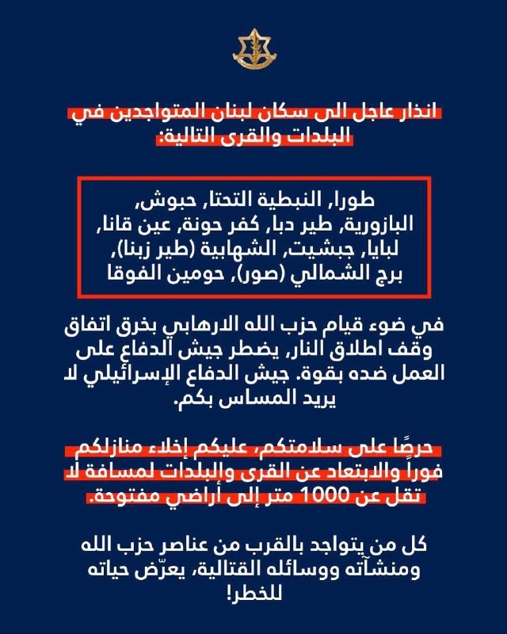

🔴ارتش اسرائیل دستور تخلیه ۱۲ روستا در جنوب لبنان را صادر کرد.

@IranianMinds

## IranianMinds — post 20383

🔴 وال استریت ژورنال :

ترامپ گفت حمله برنامه‌ریزی‌شده به ایران را متوقف کرده چون رهبران کشورهای خلیج فارس خواستند زمان بیشتری برای مذاکرات بدهند تا شاید به توافق برسند. او دستور داده ارتش آماده باشد ولی فعلاً حمله انجام نشود.

چند مقام خلیج فارس بعد این گفتند که اصلا اژ طرح حمله قریب‌ الوقوع مطلع نبوده‌اند.

@IranianMinds

## BBCPersian — post 281500

🔻دفتر رئیس‌جمهور ایران: وزرای پیشنهادی دفاع و اطلاعات به شرط تشکیل مجلس، در مهلت قانونی معرفی می‌شوند

در حالی که فقط چند هفته تا مهلت قانونی معرفی وزرای پیشنهادی دفاع و اطلاعات از سوی دولت ایران باقی مانده، دفتر ریاست جمهوری قول داده است که آن‌ها «بزودی» معرفی خواهند شد.

محمدمهدی طباطبایی، معاون ارتباطات دفتر رئیس‌جمهور ایران، به خبرگزاری تسنیم گفت که دولت مسعود پزشکیان برای معرفی وزیر پیشنهادی دفاع حدود دو هفته و برای معرفی وزیر پیشنهادی اطلاعات حدود چهل روز فرصت دارد.

او قول داد که وزرای پیشنهادی «به شرط تشکیل مجلس» در موعد مقرر برای برگزاری جلسه رأی اعتماد معرفی شوند.

مجلس ایران از زمان حملات آمریکا و اسرائیل در ۹ اسفند (۲۸ فوریه) تاکنون در محل دائمی خود تشکیل نشده است.

عزیز نصیرزاده و اسماعیل خطیب، وزرای دفاع و اطلاعات ایران در جریان حملات آمریکا و اسرائیل کشته شدند.

وزارت دفاع ایران در حال حاضر به سرپرستی سرتیپ مجید ابن‌الرضا اداره می‌شود اما نام سرپرست وزارت اطلاعات اعلام نشده است. خبرگزاری تسنیم گفته است که نام سرپرست وزارت اطلاعات «در زمان مقرر» اعلام خواهد شد.

مطابق قوانین ایران، وزارتخانه‌هایی که وزیر ندارند فقط سه ماه می‌توانند با سرپرست اداره شوند و پیش از پایان این مهلت باید وزیر پیشنهادی به مجلس معرفی یا در غیر این صورت با حکم رهبر جمهوری اسلامی ایران مدت سرپرستی تمدید شود.

https://bbc.in/43fw5tF
@BBCPersian

## BBCPersian — post 281499

🔻اموال ۵۲ نفر شامل املاک، وجوه بانکی و طلا در استان زنجان توقیف شد

رئیس کل دادگستری زنجان گفت اموال ۵۲ نفر در شهرهای مختلف این استان بر اساس قانون «قانون تشدید مجازات جاسوسی و همکاری با رژیم صهیونسیتی علیه امنیت و منافع ملی» توقیف شده است.

علی فرجی برحق گفت توقیف اموال این افراد که آنها را «خائنین به وطن و افراد تاثیرگذار در شبکه همکاران دشمن» خواند، به دستور مقام قضائی انجام شده است.

اموال توقیف شده شامل وجوه نقد بانکی و ارزی، اموال منقول و غیرمنقول و طلا بوده است.

بر اساس این گزارش هفت نفر از این افراد بازداشت شدند و برخی هم در خارج از ایران هستند.

قوه قضائیه پس از جنگ اخیر برای کسانی که «هم‌صدا» یا «همراه» دشمن می‌خواند، پرونده تشکیل می‌دهد و با استناد به قانون «تشدید مجازات جاسوسی»، مجازات‌هایی مثل ممنوعیت فعالیت و توقیف اموال در نظر می‌گیرد.

قوه قضائیه فهرست‌هایی هم از افرادی منتشر کرده که برای «حمایت از جنگ»، اموالشان توقیف یا مصادره شده است.

با تشدید ضبط اموال طیف وسیعی از اقشار جامعه از خبرنگار تا بازیگر و فعال سیاسی و هنرمند و ورزشکار، قوه قضائیه جلوگیری از انتقال اموال را هم آغاز کرده است.

https://bbc.in/49RmJrF
@BBCPersian

## BBCPersian — post 281498

🔻سقوط پرتابه در اندیمشک چهار مجروح بر جای گذاشت

به گفته ولی‌الله حیاتی، معاون امنیتی و انتظامی استانداری خوزستان، در پی سقوط پرتابه‌های ناشی از پدافند هوایی در اندیمشک چهار نفر مجروح شده‌اند.

به گزارش رسانه‌های ایران، آقای حیاتی گفت: «به‌دلیل سقوط پرتابه در منطقه مسکونی، چهار شهروند مجروح شدند که خوشبختانه در شرایط مناسب و پایدار قرار دارند و هم اکنون در مراکز درمانی به وضعیت آنان رسیدگی می‌شود.»

خبرگزاری دولتی ایرنا علت مجروح شدن این افراد را «سقوط شی ناشناس در مناطق مسکونی اندیمشک» گزارش کرد که «منجر به خسارت به یک باب مغازه و دو خودرو و مصدومیت چهار نفر شد» و «در شبکه های اجتماعی این شهرستان بازتاب گسترده داشت.»

آقای حیاتی همچنین گفت: «صدای شلیک‌های امروز در آسمان اندیمشک به‌دلیل تست پدافند هوایی است و مردم نگران نباشند.»

در روزهای اخیر فعال شدن پدافند هوایی در بعضی شهرهای ایران گزارش شده است از جمله امروز و دیشب در اصفهان که عنوان شد ناشی از «پاکسازی مناطق باقیمانده از مهمات عمل‌نکرده» است.

پیشتر گزارش‌هایی هم از فعال شدن پدافند جزیره قشم منتشر شده بود که به گفته خبرگزاری تسنیم برای مقابله با «ریز پرنده‌ها» بود.

ظهر امروز هم صدای چند انفجار در جزیره قشم شنیده شد که استانداری هرمزگان دلیل آن را «خنثی‌سازی» مهمات اعلام کرد.

https://bbc.in/49RmJrF
@BBCPersian

## BBCPersian — post 281497

  <a href="telegram/content/BBCPersian_281497_1779202217.mp4" target="_blank">🎬 Download video</a>

⭕️سرخط خبرها سه‌شنبه ۲۹ اردیبهشت ۱۴۰۵
@BBCPersian

## BBCPersian — post 281496

  

🔻سعید کرمی، معاون نهاد نمایندگی رهبر جمهوری اسلامی در دانشگاه‌ها می‌گوید دانشجویانی که اخیرا بازداشت شده‌اند، مرتکب «جرم امنیتی محسوس و تاثیرگذار» شده بودند.

او تعداد بازداشتی‌ها را «محدود و انگشت شمار» خواند وگفت: «در برخی پرونده‌ها، افرادی اقدام به ارسال لوکیشن برای عوامل بیگانه کرده‌اند.»

اشاره آقای کرمی به افرادی است که پس از آغاز جنگ آمریکا و اسرائیل با ایران بازداشت شده‌اند.

از زمان آغاز جنگ اخیر، موارد بازداشت و سختگیری‌های قضایی افزایش یافته است، هرچند مشخص نیست چند نفر از بازداشت‌شدگان دانشجو هستند.

احمدرضا رادان، فرمانده کل نیروی انتظامی، دو روز پیش گفت که از آغاز جنگ اخیر «بیش از ۶۵۰۰ نفر از وطن‌فروشان و جاسوسان دستگیر شده‌اند.»

خبرگزاری هرانا، ارگان خبری مجموعه فعالان حقوق بشر، هم می‌گوید که از زمان شروع جنگ تا هفته گذشته، دست‌کم ۴۰۲۳ بازداشت را در ایران ثبت کرده است.

به گفته این نهاد، اتهام‌های مطرح‌شده شامل جاسوسی، تهدید علیه امنیت ملی و ارتباط یا ارسال مطالب مربوط به جنگ به رسانه‌های خارجی است.

📷Getty Images
@BBCPersian

## BBCPersian — post 281495

  

🔻یوروپل، «آژانس اتحادیه اروپا برای همکاری در اجرای قانون»، می‌گوید در اقدامی هماهنگ برای مقابله با «محتوای تروریستی آنلاین»، ۱۴۲۰۰ پست مرتبط با سپاه پاسداران را در فضای مجازی هدف قرار داده است.

اتحادیه اروپا سپاه پاسداران را در ۱۹ فوریه ۲۰۲۶ سازمانی تروریستی معرفی کرد؛ این طبقه‌بندی به مجریان قانون اجازه می‌دهد تا علیه فعالیت‌های اعضای سپاه و نهادهای حامی آن در اتحادیه اروپا اقدام کنند.

یوروپل می‌گوید که اقداماتش بر شناسایی و مختل کردن حضور آنلاین گروه‌های مرتبط با سپاه پاسداران متمرکز بوده است که برای انتشار تبلیغات، جذب هواداران و جمع‌آوری کمک‌های مالی مورد استفاده قرار می‌گرفتند.

۱۸ کشور اروپایی و آمریکا در این اقدامات هماهنگ شرکت داشتند.

یوروپل می‌گوید که محتواهای تولید شده مرتبط با سپاه پاسداران، به چندین زبان از جمله عربی، اندونزیایی، انگلیسی، فرانسوی، فارسی و اسپانیایی شناسایی شده است.

📸GettyImages
https://bbc.in/3PydzJU
@BBCPersian

## BBCPersian — post 281490

🔸باشگاه منچستر سیتی خودش را برای جدایی از پپ گواردیولا، مردی که پرافتخارترین دوران این باشگاه را رقم زد، پس از بازی روز یکشنبه لیگ برتر مقابل استون ویلا آماده می‌کند.

انتظار می‌رود که این سرمربی بزرگ در پایان فصل، ورزشگاه اتحاد را ترک کند و آن طور که گفته می‌شود انزو مارسکا، سرمربی پیشین چلسی، جای او را می‌گیرد. این مربی ۵۵ ساله سابقه دستیاری گواردیولا در سیتی را نیز دارد.

مدیران سیتی قبلا گفته بودند که گواردیولا برای فصل آینده قرارداد دارد و امیدوارند در سمتش باقی بماند ولی با توجه به اخبار باشگاه حالا این جدایی قطعی است و گفته می‌شود که بازیکنان هم آماده خداحافظی با این سرمربی اسپانیایی در آخرین بازی فصل مقابل استون ویلا شده‌اند.

همزمان باشگاه تمرکز خود را روی یافتن بهترین راه برای تجلیل از دوران حضور این سرمربی نمادین گذاشته است. گفته می‌شود نامگذاری جایگاه شمالی تازه توسعه‌یافته به نام این سرمربی یکی از گزینه‌های مدنظر باشگاه است.

مطلب کامل:
https://bbc.in/42JXp31
📷Getty
@BBCPersian

## BBCPersian — post 281489

🔻قطر: مذاکرات ایران و آمریکا به زمان بیشتری نیاز دارد

سخنگوی وزارت خارجه قطر می‌گوید که مذاکرات آمریکا و ایران برای دستیابی به یک توافق به زمان بیشتری نیاز دارد.

ماجد الانصاری، سخنگوی وزارت خارجه قطر، روز سه‌شنبه در یک کنفرانس مطبوعاتی گفت: «ما از تلاش‌های دیپلماتیک پاکستان که جدیت خود را در گرد هم آوردن طرف‌ها و یافتن راه‌حل نشان داده است، حمایت می‌کنیم و معتقدیم که این امر به زمان بیشتری نیاز دارد.»

دیروز دونالد ترامپ گفت که به درخواست رهبران عربستان، امارات و قطر، حمله‌ای را که تصمیم داشت روز سه‌شنبه به ایران انجام دهد، لغو کرده است. او گفت که رهبران این سه کشور معتقدند توافقی قابل حصول است که هم برای آمریکا و هم برای کشورهای منطقه «بسیار قابل قبول» است.

https://bbc.in/4uRZRR2
@BBCPersian

## BBCPersian — post 281479

🖊انکور شاه, سردبیر واحد چین جهانی بی‌بی‌سی

سپتامبر گذشته، زمانی که شی جین‌پینگ، رئیس‌جمهور چین، و ولادیمیر پوتین، رئیس‌جمهور روسیه، در میدان تیان‌آن‌من پکن قدم می‌زدند، به نظر می‌رسید درباره این احتمال صحبت می‌کنند که پیوند اعضا بتواند عمر انسان را به‌طور چشمگیری افزایش دهد.

شنیده شده که مترجم ولادیمیر پوتین گفت: «اعضای بدن انسان می‌تواند به‌طور مداوم پیوند زده شود. هرچه بیشتر زندگی کنید، جوان‌تر می‌شوید و حتی به جاودانگی می‌رسید.»

و مترجم شی جین‌پینگ پاسخ داد: «برخی پیش‌بینی می‌کنند که در این قرن، انسان‌ها ممکن است تا ۱۵۰ سال عمر کنند.»

آلبوم را ورق بزنید و برای خواندن مطلب کامل، به لینک زیر مراجعه کنید:
https://bbc.in/4wELpgO
📷Sputnik/ Kremlin/ PA/Shutterstock/China News Service/VCG/AFP/ Getty Images/BBCImages

## idfinfarsi — post 11610

  <a href="telegram/content/idfinfarsi_11610_1779202220.mp4" target="_blank">🎬 Download video</a>

🎬 Video

## idfinfarsi — post 11609

در راستای رفع تهدید علیه نیروهای ما: ارتش اسرائیل یک انبار حاوی ده‌ها نوع تسلیحات و یک چاهک پرتاب راکت متعلق به سازمان تروریستی حماس را منهدم کرد

ارتش اسرائیل دیشب (دوشنبه) یک انبار تسلیحات و یک چاهک پرتاب راکت متعلق به سازمان تروریستی حماس را در شمال نوار غزه منهدم کرد.

در انبار هدف‌گرفته‌شده ده‌ها نوع سلاح مختلف نگهداری می‌شد، از جمله بیش از ۲۰ خمپاره، پرتابگرها، مواد انفجاری، سلاح‌هایی از نوع کلاشنیکوف و تجهیزات رزمی دیگر.

چاهک پرتاب راکت و تسلیحات موجود برای حمله به نیروهای ارتش اسرائیل در محدوده خط زرد و شهروندان کشور اسرائیل در نظر گرفته شده بود و به‌منظور رفع این تهدید منهدم شد.

نیروهای ارتش اسرائیل در فرماندهی جنوب مطابق توافق در منطقه مستقر هستند و به فعالیت برای رفع هرگونه تهدید فوری ادامه خواهند داد.

## Dirty_Kids — post 389752

همین عرزشیا که بخاطر یک شب چهارشنبه سوری ، از آلودگی صوتی ناراحتن،
۸۰روزه کنار خیابون عرعر میکنن🫏🫏

@Dirty_Kids 👻

## Dirty_Kids — post 389751

  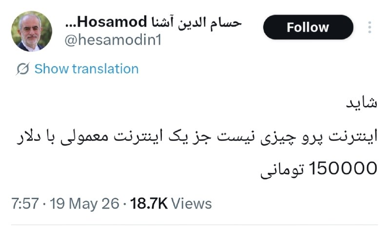

شاید مادرت، یه جنده معمولیه ،که الان شده چنده پرو 🙄
‌‎
در مورد سیمکارت سفید و دارندگان مادرقحبه‌ش هم کمی توضیح بدهید لطفا.

@Dirty_Kids 👻

## Dirty_Kids — post 389749

چرا حتی یک نفرتون شکل آدم نیست؟

@Dirty_Kids 👻

## Dirty_Kids — post 389748

  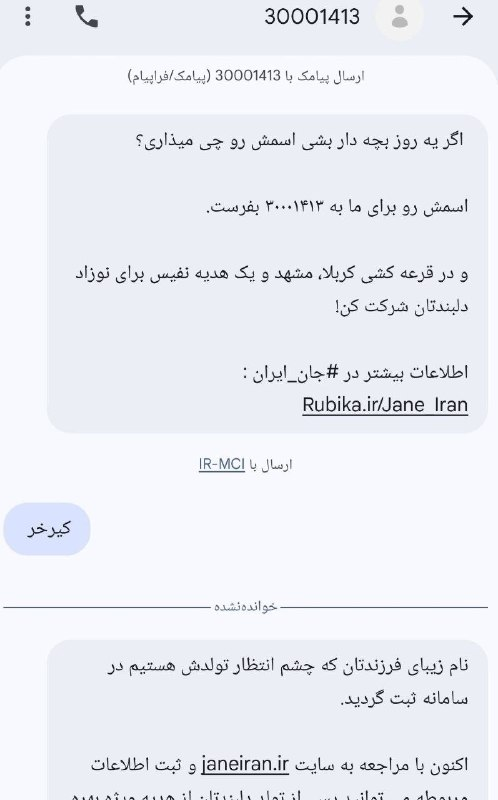

((((((:

@Dirty_Kids 👻

## Dirty_Kids — post 389747

  <a href="telegram/content/Dirty_Kids_389747_1779202221.mp4" target="_blank">🎬 Download video</a>

🔴 فوری، تلگرام به خطر افتاد!

بابک زنجانی دزد رسما فعالیت شبکه اجتماعی خودش به اسم «مای دات» رو استارت زد تا این سوپر اپلیکیشن با تلگرام رقابت کنه.

ما رقابتی نداریم همینجارو دوست داریم

@Dirty_Kids 👻

## Dirty_Kids — post 389745

خبرگزاری ایرنا گزارشی به نام «مهر مادری به عمر چهل روز» منتشر کرده، درباره زنی که کودکی رها شده در دوران جنگ را به فرزندی پذیرفته. گزارش شامل مجموعه‌ عکسی از سارا کنعانی و فرزندش است و عکس‌هایی در خانه به تصویر کشیده شده، برخلاف فضاهای عمومی، سارا حجاب ندارد.…

## Dirty_Kids — post 389741

خبرگزاری ایرنا گزارشی به نام «مهر مادری به عمر چهل روز» منتشر کرده، درباره زنی که کودکی رها شده در دوران جنگ را به فرزندی پذیرفته.

گزارش شامل مجموعه‌ عکسی از سارا کنعانی و فرزندش است و عکس‌هایی در خانه به تصویر کشیده شده، برخلاف فضاهای عمومی، سارا حجاب ندارد.

@Dirty_Kids 👻

## Dirty_Kids — post 389738

🔴‌حالتون از این همه تناقض و دورویی بهم نمی‌خوره؟

دیروز هتل تاریخی عامری‌ها کاشان را به‌خاطر «حجاب» پلمب کردند؛ مسافران سرگردان شدند و ۹۰ نفر از پرسنل بیکار!

‏اما همزمان، شب‌ها در میدان‌ها و مراسم‌هایی مثل #جان_فدا⁩، شعار «بی‌حجاب هم خواهر ماست» تکرار می‌شود و همان زنان با آزادترین پوشش در قاب رسمی دیده می‌شوند.

‏اگر حجاب قانون است، چرا اجرای آن این‌قدر مقطعی و گزینشی است؟ #یاشارسلطانی

@Dirty_Kids 👻

## Dirty_Kids — post 389737

🔴 یه نفر دیگه از نیرو های سپاه پاسداران در عملیات خنثی‌سازی بمب های عمل نکرده امریکا و اسرائیل دیروز منفجر شد.

@Dirty_Kids 👻

## Dirty_Kids — post 389736

  

قال موش‌علی: دفن نخواهم شد و تشییع جنازه نخواهیم گرفت :)))

@Dirty_Kids 👻

## Dirty_Kids — post 389735

  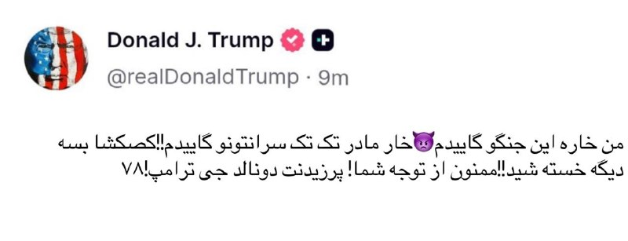

بعید نیست ترامپ چند روز دیگه‌ همچین توییتی بزنه: 😂😂

@Dirty_Kids 👻

## Dirty_Kids — post 389734

  <a href="telegram/content/Dirty_Kids_389734_1779202223.mp4" target="_blank">🎬 Download video</a>

از کیرشناسی تا شاعری 🔞 تا آخر ببینید

بعد همین جنده‌ها با این ادبیات میان میگن شما بی‌ادبید

@Dirty_Kids 👻

## Hranews — post 113041

  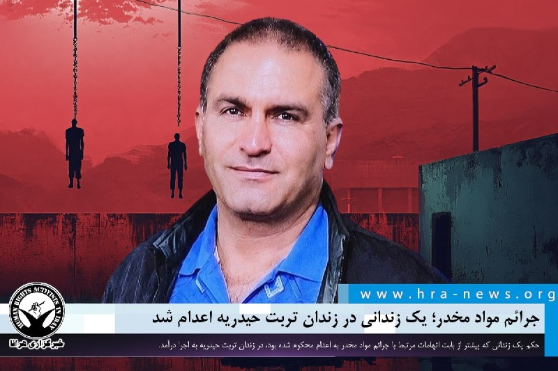

جرائم مواد مخدر؛ یک زندانی در زندان تربت حیدریه اعدام شد

❗️
❗️
❗️
❗️
❗️– سحرگاه روز شنبه ۲۶ اردیبهشت ماه، حکم یک زندانی که پیشتر از بابت اتهامات مرتبط با جرائم مواد مخدر به اعدام محکوم شده بود، در زندان تربت حیدریه به اجرا درآمد.

به گزارش خبرگزاری هرانا، ارگان خبری مجموعه فعالان حقوق بشر در ایران، حکم #اعدام یک زندانی در زندان تربت حیدریه اجرا شد.

هویت این زندانی که سحرگاه روز شنبه ۲۶ اردیبهشت ۱۴۰۵ به چوبه دار آویخته شد، ابراهیم فرهادی توپکانلو، ۴۸ساله، پدر سه فرزند و اهل سبزوار، توسط هرانا احراز شده است.

ادامه مطلب

#ابراهیم_فرهادی_توپکانلو

↘️
@hranews_bot تماس ✉️ - @Hranews کانال هرانا 🆑

## Hranews — post 113040

  

شهاب دلیلی آزاد شد و به آمریکا بازگشت

❗️
❗️
❗️
❗️
❗️– شهاب دلیلی، شهروند ایرانی دارای اقامت دائم آمریکا که در زندان اوین محبوس بود، پس از ۱۰ سال حبس، آزاد شد. وی پس از آزادی به آمریکا بازگشته است.

ادامه مطلب

#شهاب_دلیلی

↘️
@hranews_bot تماس ✉️ - @Hranews کانال هرانا 🆑

## Hranews — post 113039

  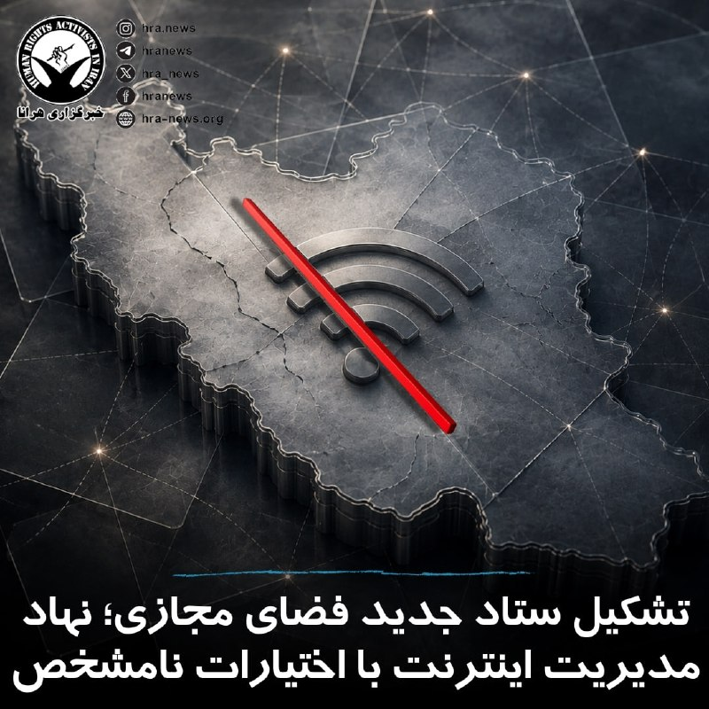

در حالی‌که اینترنت در ایران طی هفته‌های اخیر با قطع و اختلال گسترده مواجه بوده، ایجاد یک ساختار جدید برای مدیریت فضای مجازی، ابهام‌ها درباره نحوه تصمیم‌گیری در این حوزه را افزایش داده است. روزنامه شرق با انتشار گزارشی اعلام کرده که «ستاد ساماندهی و راهبری فضای مجازی» در همین شرایط شکل گرفته، اما جزئیات دقیقی از نحوه فعالیت و حدود اختیارات آن منتشر نشده است. حتی به اعضای هیئت دولت نیز تاکید شده درباره این ستاد با رسانه‌ها گفت‌وگو نکنند. با این حال، بر اساس پیگیری‌های این روزنامه، ترکیب این ستاد شامل نهادهای دولتی، امنیتی و حاکمیتی از جمله دادستان کل کشور، نماینده‌ای از مجلس، وزارتخانه‌های ارشاد، ارتباطات، اطلاعات و علوم، معاونت علمی و فناوری ریاست‌جمهوری، دبیران شورای عالی فضای مجازی و شورای عالی امنیت ملی، اطلاعات سپاه و همچنین سه عضو از بخش خصوصی است.

به‌نوشته شرق، هم‌زمان با این سکوت و ابهام در اختیارات، شائبه شکل‌گیری یک مرکز تازه قدرت در سیاست‌گذاری اینترنت تقویت شده است. این روزنامه با اشاره به تعدد نهادهای فعال در حوزه فضای مجازی نوشت که برخی منتقدان، تشکیل این ستاد را نوعی موازی‌کاری و نشانه‌ای از ناکارآمدی ساختار فعلی می‌دانند؛ وضعیتی که در آن، به‌جای حل بحران، پیچیدگی تصمیم‌گیری افزایش یافته و همچنان این پرسش بی‌پاسخ مانده که مسئول نهایی اینترنت در ایران کدام نهاد است.
#قطع_اینترنت #فضای_مجازی

↘️
@hranews_bot تماس ✉️ - @Hranews کانال هرانا 🆑

## Hranews — post 113038

مصادره اموال ۵۲ شهروند در زنجان؛ ۷ نفر بازداشت شدند

❗️
❗️
❗️
❗️
❗️– مرکز رسانه قوه قضاییه از توقیف اموال ۵۲ شهروند در استان زنجان خبر داد. هفت تن از این افراد که در ایران سکونت دارند، #بازداشت شدند.

ادامه مطلب

#مصادره_اموال

↘️
@hranews_bot تماس ✉️ - @Hranews کانال هرانا 🆑

## Hranews — post 113037

یک کارگر معدن نگین طبس بر اثر گازگرفتگی جان‌ باخت

❗️
❗️
❗️
❗️
❗️– دبیر اجرایی خانه کارگر طبس اعلام کرد که یک #کارگر_معدن نگین واقع در منطقه معدنی پرورده این شهر، به دلیل کمبود تجهیزات مناسب کار بر اثر گازگرفتگی جان خود را از دست داده است.

ادامه مطلب

#جواد_پسرکلو

↘️
@hranews_bot تماس ✉️ - @Hranews کانال هرانا 🆑

## Hranews — post 113036

  

محروم از درمان؛ گزارشی از آخرین وضعیت یاشار تبریزی در زندان تبریز

❗️
❗️
❗️
❗️
❗️– یاشار تبریزی، فعال مدنی محبوس در زندان تبریز، با وجود ابتلا به عفونت چشم و بیماری قلبی، از دسترسی به رسیدگی پزشکی تخصصی و اعزام به مراکز درمانی خارج از زندان محروم مانده است. وی در حال سپری کردن دوران محکومیت هفت ماه حبس خود در این زندان است.

به گزارش خبرگزاری هرانا، ارگان خبری مجموعه فعالان حقوق بشر در ایران، #یاشار_تبریزی، با وجود داشتن مشکلات جسمی از رسیدگی پزشکی مناسب محروم مانده است.

یک منبع مطلع و نزدیک به خانواده آقای تبریزی با تأیید این خبر به هرانا گفت: در زمان بازداشت، ضربه‌ای به چشم چپ آقای تبریزی وارد شده که منجر به عفونت شده است. با وجود نیاز به رسیدگی تخصصی، وی تاکنون به بیمارستانی خارج از زندان اعزام نشده و صرفاً خدمات محدود بهداری زندان را دریافت می‌کند. او همچنین از بیماری‌های قلبی رنج می‌برد و از این نظر نیز در وضعیت جسمانی نامساعدی قرار دارد.

ادامه مطلب

↘️
@hranews_bot تماس ✉️ - @Hranews کانال هرانا 🆑

## manototv — post 105640

  <a href="telegram/content/manototv_105640_1779202224.mp4" target="_blank">🎬 Download video</a>

سازمان جهانی بهداشت شیوع ابولا در جمهوری دموکراتیک کنگو و اوگاندا را وضعیت اضطراری بهداشت عمومی با اهمیت بین‌المللی اعلام کرده است. تاکنون ده‌ها مورد مشکوک و چندین مورد مرگ ثبت شده و برخی مبتلایان از کنگو به اوگاندا سفر کرده‌اند.
سازمان جهانی بهداشت این وضعیت را به دلیل گسترش فرامرزی، افزایش سریع موارد، مرگ کادر درمان و ضعف زیرساخت‌های بهداشتی اضطراری اعلام کرده است.
در واکنش به شیوع، برخی کشورها از جمله آمریکا محدودیت‌های سفر اعمال کرده و تیم‌های بین‌المللی برای کنترل بیماری به منطقه اعزام شده‌اند.
مقامات تاکید کرده‌اند خطر برای عموم مردم خارج از مناطق درگیر پایین است، اما بیماری از طریق تماس مستقیم با مایعات بدن افراد مبتلا منتقل می‌شود و می‌تواند کشنده باشد. علائم بیماری شامل تب ناگهانی، خستگی شدید، درد عضلانی، اسهال، استفراغ و در موارد شدید خونریزی است.

## manototv — post 105639

  <a href="telegram/content/manototv_105639_1779202225.mp4" target="_blank">🎬 Download video</a>

به‌دنبال وزش باد شدید و خیزش گرد و خاک، کیفیت هوای تهران در شرایط ناسالم و قرمز قرار گرفت و به همه شهروندان توصیه شده از تردد غیرضروری در فضای باز خودداری کنند. اداره کل هواشناسی استان تهران نیز اعلام کرده است که طی ۲۴ ساعت آینده وزش باد و گرد و خاک در سطح استان ادامه خواهد داشت.

## manototv — post 105638

  <a href="telegram/content/manototv_105638_1779202225.mp4" target="_blank">🎬 Download video</a>

انفجاری در حاشیه شرقی دمشق و در نزدیکی مرکز مدیریت تسلیحات وابسته به وزارت دفاع سوریه در منطقه باب الشرقی رخ داد. این حادثه به‌گفته منابع محلی ناشی از انفجار یک خودروی بمب‌گذاری‌شده یا یک بمب کارگذاشته‌شده در خودرو بوده است. برخی گزارش‌ها نیز حاکی از آن است که نیروهای امنیتی خودرو را مشکوک تشخیص داده و در جریان اقدام برای کنترل آن، انفجار زودتر از موعد رخ داده یا یک بمب دیگر نیز در نزدیکی محل خنثی شده است. در این انفجار یک افسر نیروهای امنیت داخلی کشته و چهار نفر دیگر از نیروهای امنیتی و نظامی زخمی شدند. پس از حادثه، مسیرهای اطراف بسته شد، نیروهای امدادی و آمبولانس‌ها در محل حاضر شدند و نیروهای امنیتی منطقه را محاصره کرده و تحقیقات جنایی و فنی آغاز شد. این سومین یا چهارمین مورد از انفجارها و حملات مشابه در دمشق و حومه در طول ماه جاری است و تاکنون هیچ گروهی مسئولیت این حمله را بر عهده نگرفته است.

## manototv — post 105637

  <a href="telegram/content/manototv_105637_1779202226.mp4" target="_blank">🎬 Download video</a>

فرماندهی مرکزی ارتش آمریکا اعلام کرد نیروهای این کشور هم‌زمان با عبور ناو هواپیمابر آبراهام لینکلن از دریای عرب، ۸۸ کشتی تجاری را تغییر مسیر داده و چهار کشتی دیگر را برای «اطمینان از رعایت کامل» مقررات عملیاتی از کار انداخته‌اند.

بر اساس متن منتشرشده از سوی سنتکام، یک ملوان نیروی دریایی آمریکا روز دوشنبه ۲۸ اردیبهشت هنگام عبور ناو آبراهام لینکلن از دریای عرب، در حال دیده‌بانی روی عرشه این ناو دیده می‌شود.

## manototv — post 105636

  <a href="telegram/content/manototv_105636_1779202226.mp4" target="_blank">🎬 Download video</a>

استونی اعلام کرد یک جنگنده ناتو یک پهپاد مشکوک را در حریم هوایی این کشور سرنگون کرده است. این پهپاد از سمت روسیه وارد آسمان استونی شده بود و با یک موشک توسط یک جنگنده رومانیایی ناتو هدف قرار گرفت. همزمان لتونی هم هشدار هوایی صادر کرد و اعلام شد یک پهپاد وارد حریم هوایی این کشور شده و باعث شد در برخی مناطق مرزی قطارها و امتحانات مدارس متوقف و فروشگاه‌ها بسته شوند. استونی و لتونی روسیه را به اختلال در جی پی اس و جنگ الکترونیک متهم کرده و این رخدادها را مرتبط با جنگ اوکراین می‌دانند. ناتو تایید کرده که جنگنده عضو این پیمان این پهپاد را ساقط کرده و اعلام کرده تحقیقات درباره این حادثه ادامه دارد. هنوز مشخص نیست پهپادی که وارد لتونی و استونی شده یکی بوده یا چند پهپاد جدا و در روزهای اخیر چند کشور منطقه نیز موارد مشابه مشاهده کرده‌اند و این موضوع نگرانی‌ها درباره گسترش جنگ به کشورهای همسایه روسیه را افزایش داده است.

## manototv — post 105635

  <a href="telegram/content/manototv_105635_1779202227.mp4" target="_blank">🎬 Download video</a>

خبرگزاری رویترز گزارش داد پالایشگاه‌های دولتی چین از زمان آغاز جنگ ایران، تولید خود را بیش از یک میلیون بشکه در روز کاهش داده‌اند.
بر اساس این گزارش، اختلال در تامین نفت خاورمیانه و کاهش سودآوری پالایشگاه‌ها باعث شده شرکت‌های بزرگ نفتی چین از جمله سینوپک و پتروچاینا ظرفیت پالایش خود را کاهش دهند.
داده‌ها نشان می‌دهد میزان پالایش نفت خام در چین از حدود ۱۰ میلیون بشکه در روز پیش از حملات آمریکا و اسرائیل به ایران، به حدود ۸.۴ میلیون بشکه در ماه مه رسیده است.
رویترز همچنین گزارش داد افزایش قیمت نفت و کاهش تقاضا برای سوخت، حاشیه سود پالایشگاه‌های چینی را به‌شدت کاهش داده و همزمان محدودیت‌های دولت چین بر صادرات سوخت، باعث افزایش ذخایر داخلی بنزین و گازوئیل شده است.

## manototv — post 105634

  <a href="telegram/content/manototv_105634_1779202227.mp4" target="_blank">🎬 Download video</a>

ولی‌الله حیاتی، معاون امنیتی استانداری خوزستان، بعدازظهر سه‌شنبه ۲۹ اردیبهشت گفت سقوط یک «پرتابه» یا «شی ناشناس» در یک منطقه مسکونی اندیمشک چهار مصدوم بر جا گذاشت.

به گزارش ایرنا، این مقام محلی گفت این حادثه به یک باب مغازه و دو خودرو خسارت وارد کرده و بازتاب گسترده‌ای در شبکه‌های اجتماعی این شهرستان داشته است.

حیاتی در توضیح جداگانه‌ای درباره صداهای شنیده‌شده در آسمان اندیمشک گفت: «صدای شلیک‌های اخیر در آسمان اندیمشک به دلیل تست پدافند هوایی است، لذا مردم نگران نباشند.»

با این حال رسانه‌های داخلی و مقام‌های جمهوری اسلامی هنوز توضیحی درباره ماهیت «شی ناشناس» یا «پرتابه» سقوط‌کرده ارائه نکرده‌اند و مشخص نیست این حادثه ارتباطی با تست پدافند هوایی داشته است یا نه.

## manototv — post 105633

  <a href="telegram/content/manototv_105633_1779202228.mp4" target="_blank">🎬 Download video</a>

سخنگوی وزارت خارجه قطر اعلام کرد دوحه همچنان با واشنگتن و تهران در تماس است و این رایزنی‌ها ادامه خواهد داشت.
ماجد الانصاری، در واکنش به تصمیم دونالد ترامپ برای تعویق حمله برنامه‌ریزی‌شده به ایران به درخواست قطر، عربستان سعودی و امارات، گفت این اقدام «نشانه پاسخ مثبت» بوده است.
او همچنین با اشاره به مذاکرات میان آمریکا و جمهوری‌اسلامی گفت قطر از تلاش‌های دیپلماتیک پاکستان برای نزدیک کردن طرف‌ها و یافتن راه‌حل حمایت می‌کند و این روند «به زمان بیشتری نیاز دارد».
الانصاری درباره روابط دوحه و تهران گفت قطر همچنان روابط مثبتی با جمهوری‌اسلامی دارد، اما در عین حال افزود حمله جمهوری‌اسلامی به قطر «تهدیدی برای روابط دو کشور» به شمار می‌رود

## alonews — post 121120

  <a href="telegram/content/alonews_121120_1779202228.webm" target="_blank">🎬 Download video</a>

🔴فوری / ترامپ درباره زمان حمله به ایران: «۲-۳ روز دیگر، شاید جمعه یا شنبه، اوایل هفته آینده. یک دوره زمانی محدود.

✅ @AloNews خبر جنگ

## alonews — post 121119

  <a href="telegram/content/alonews_121119_1779202228.webm" target="_blank">🎬 Download video</a>

👈وزارت دفاع امارات ادعا کرد که سامانه‌های پدافند هوایی در ۴۸ ساعت گذشته، ۶ فروند پهپاد را رهگیری کرده‌اند.

🔴تحقیقات روشن کردند که حمله پهپادی ۲۷ اردیبهشت (۱۷ مه) به نیروگاه هسته‌ای برکه از عراق انجام شده است.

✅ @AloNews خبر جنگ

## alonews — post 121118

  <a href="telegram/content/alonews_121118_1779202228.mp4" target="_blank">🎬 Download video</a>

👈ترامپ درباره سالن رقص کاخ سفید:
تمام این هزینه‌ها را خودم پرداخت کرده‌ام. این یک هدیه است.

🔴این هدیه‌ای به ایالات متحده آمریکا است

🔴این بیش از یک هدیه است؛ این قرار است یکی از زیباترین ساختمان‌هایی باشد که تاکنون در کشور یا در واشنگتن دی‌سی ساخته شده است

✅ @AloNews خبر جنگ

## alonews — post 121117

  <a href="telegram/content/alonews_121117_1779202230.mp4" target="_blank">🎬 Download video</a>

👈فرمانده ارشد ناتو، الکسوس گرینکوویچ: در مجموع ۵۰۰۰ نیروی نظامی آمریکا از اروپا خارج خواهند شد.

✅ @AloNews خبر جنگ

## alonews — post 121116

  <a href="telegram/content/alonews_121116_1779202232.webm" target="_blank">🎬 Download video</a>

👈وزارت دفاع امارات متحده عربی مدعی شد نتایج تحقیقات فنی مربوط به حمله به نیروگاه هسته‌ای براکه در تاریخ ۱۷ مه ۲۰۲۶ تأیید کرد که هر سه پهپاد مهاجم از خاک عراق پرواز کرده‌اند

✅ @AloNews خبر جنگ

## alonews — post 121115

  <a href="telegram/content/alonews_121115_1779202232.webm" target="_blank">🎬 Download video</a>

👈ادعای امارات: طی ۴۸ ساعت گذشته با ۶ پهپاد که قصد داشتند مناطق مسکونی و حیاتی را هدف قرار دهند، مقابله کردیم

✅ @AloNews خبر جنگ

## alonews — post 121114

  <a href="telegram/content/alonews_121114_1779202232.webm" target="_blank">🎬 Download video</a>

👈معاون وزیر خارجه ایران : ایران آماده‌ست با هر جور تجاوز نظامی روبرو بشه، ما یا پیروز می‌شویم یا شهید می‌شویم

✅ @AloNews خبر جنگ

## alonews — post 121113

  <a href="telegram/content/alonews_121113_1779202232.webm" target="_blank">🎬 Download video</a>

👈نرخ دلار امروز، ۱۷۸,۵۴۸ هزارتومن

✅ @AloNews خبر جنگ

## alonews — post 121110

  <a href="telegram/content/alonews_121110_1779202232.mp4" target="_blank">🎬 Download video</a>

👈 انفجار یک وسیله نقلیه حامل بمب دست‌ساز در نزدیکی ساختمان وزارت دفاع بود.

✅ @AloNews خبر جنگ

## alonews — post 121109

  <a href="telegram/content/alonews_121109_1779202235.webm" target="_blank">🎬 Download video</a>

👈وزارت بهداشت لبنان از آغاز حمله اسرائیل در دوم مارس، 3042 کشته و 9301 زخمی گزارش می دهد

✅ @AloNews خبر جنگ

## alonews — post 121108

  <a href="telegram/content/alonews_121108_1779202235.webm" target="_blank">🎬 Download video</a>

👈سفیر چین در تهران: حمایت پکن از ایران، آشکار و بی‌چون و چرا است!

✅ @AloNews خبر جنگ

## alonews — post 121107

  <a href="telegram/content/alonews_121107_1779202236.webm" target="_blank">🎬 Download video</a>

👈دراپ‌سایت: براساس داده‌های ردیابی کشتی‌ها از Lloyds List Intelligence، ترافیک عبوری از تنگه هرمز در هفته ۱۱ تا ۱۷ مه به ۵۴ فروند کشتی افزایش یافت که بیش از دو برابر ۲۳ فروند هفته قبل است

🔴این افزایش شامل ۱۰ فروند کشتی متعلق به چین است‌. رسانه‌های دولتی ایران اعلام کرده بودند که تهران به کشتی‌های چینی اجازه عبور می‌دهد

🔴همچنین یک کشتی حامل ال.ان.جی متعلق به ادنوک (ADNOC) که از طریق عبور مخفیانه (با خاموش بودن فرستنده ردیاب خود) وارد خلیج فارس شد. دو کشتی حامل ال‌پی‌جی نیز خلیج فارس را به مقصد هند ترک کردند.

🔴این بهبود نسبی همچنان بسیار کمتر از میزان تردد قبل از جنگ است. پیش از آنکه آمریکا و اسرائیل در اواخر فوریه به ایران حمله کنند، ماهانه حدود ۳۰۰۰ فروند کشتی از تنگه عبور می‌کردند - یعنی حدود ۱۰۰ تا ۱۴۰ فروند در روز - که حامل ۱۵ میلیون بشکه نفت خام و فرآورده‌های نفتی در روز بودند، یعنی تقریباً یک‌پنجم تجارت جهانی نفت. در کل ماه آوریل، فقط ۱۹۱ عبور ثبت شده است.

✅ @AloNews خبر جنگ

## alonews — post 121106

  <a href="telegram/content/alonews_121106_1779202236.mp4" target="_blank">🎬 Download video</a>

👈حزب‌الله همچنان داره تانک‌های مرکاوای اسرائیل رو تو جنوب لبنان میزنه

✅ @AloNews خبر جنگ

## alonews — post 121105

  <a href="telegram/content/alonews_121105_1779202237.webm" target="_blank">🎬 Download video</a>

👈عراق: قاطعانه استفاده از خاک خود برای حمله علیه همسایگان را رد می‌کنیم

✅ @AloNews خبر جنگ

## alonews — post 121104

  <a href="telegram/content/alonews_121104_1779202237.webm" target="_blank">🎬 Download video</a>

👈زنگ خطر آژانس بین‌المللی انرژی درباره بحران بزرگ سوخت به صدا درآمد

✅ @AloNews خبر جنگ

## alonews — post 121103

  <a href="telegram/content/alonews_121103_1779202237.mp4" target="_blank">🎬 Download video</a>

🔴چی میشه که 57ی ها این سخنرانی ها رو شنیدن ولی گول ملاها و رجوی ها رو خوردن؟

🔴دیگه چه توقعی از بچه‌هاشون و همفکراشون دارید؟

🔴معلومه درکی از پیشرفت ایران ندارن و نمیفهمن سیستان و بلوچستان یا خوزستان و آبادان چقدر میتونند پیشرفت کنن.

🤔ایران گلستان رو تو همه موارد چه اجتماعی چه اقتصادی و... به جهنم تبدیل کردن.

✅@AloNews

## alonews — post 121102

  <a href="telegram/content/alonews_121102_1779202239.webm" target="_blank">🎬 Download video</a>

👈وزیر خزانه‌داری آمریکا : دنبال سرکوب جهانی شبکه‌های بانکداری مخفی ایرانیم

✅ @AloNews خبر جنگ

## alonews — post 121101

  <a href="telegram/content/alonews_121101_1779202239.webm" target="_blank">🎬 Download video</a>

👈الجزیره: تعویق نشست شورای امنیت ملی در کاخ سفید

🔴یک مقام آمریکایی به الجزیره گفت که نشست شورای امنیت ملی در کاخ سفید امروز، پس از آن‌که ترامپ حمله به ایران را به عقب انداخت، به تعویق افتاد.

✅ @AloNews خبر جنگ

<!-- MSG END -->

<!-- NAV START -->

<a href="https://github.com/SIL3NC398/aio-downloader/blob/main/telegram/content/archive_1.md" style="display:inline-block; padding:6px 12px; margin:0 4px; background-color:#2ea44f; color:white; text-decoration:none; border-radius:4px; font-weight:bold;">صفحه بعد</a>

<!-- NAV END -->
